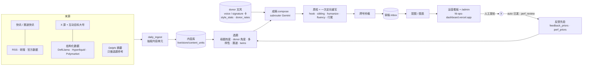

# Finance Distillation（FD）

FD 是 Mango Labs 的 **X（Twitter）多账号金融内容流水线**：每天从公开、合规的来源（新闻快讯、研报、官方数据、链上数据、同赛道 X 大号）抓素材，按 36 个账号各自的人设和 donor 文风（donor = 我们学习文风的真实 X 博主）写成草稿，经质检后放到运营看板，由运营同事**人工发帖**。

- **系统不会自动发帖。** 它只产出草稿、建议发帖时间和配图，并在发帖后自动识别「已发」。
- 当前开发分支：`fd-phase0`（`main` 是 Phase 0 之前的冻结快照）。
- 本 README 描述 2026-10-10 的系统现状（HEAD ≈ `eb418a9`）。更细的设计见 `docs/`（`PIPELINE_AS_BUILT.md`、`HOTSPOT.md`、`TOPIC_DIVERSITY.md`、`MEDIA_SOURCES.md`、`ARCHIVE_LOOKBACK.md`、`DELPHI_DIGEST.md`、`RUNBOOK.md`）。

---

## 1. 36 个账号

账号表在 `live/fd20_accounts.json`（1–20 号主号）、`live/fd_accounts_extra.json`（21–26 号备用号，`FD_ACCOUNTS_EXTRA`）、`live/fd_accounts_new.json`（27–36 号新号，`FD_ACCOUNTS_NEW`），统一由 `live/fd_accounts.py` 的 `rows()` 读取。handle 是公开 X 账号名。

| # | 人设名 | 账号 id（lane） | 语言 | 赛道 | X handle |
|---|---|---|---|---|---|
| 1 | 墨川.eth | `crypto_macro_zh` | zh | 加密宏观 · BTC/ETH 大势 | @oklatiendita |
| 2 | 链上阿树 | `crypto_onchain_zh` | zh | 链上数据 · 筹码 · ETF 资金流 | @tomasznick |
| 3 | 山猫 | `crypto_research_zh` | zh | 行业研究 · 赛道与叙事 | @mareczek_16 |
| 4 | 岑哥K线日记 | `crypto_trader_zh` | zh | 交易复盘 · K 线点位 | @a_plachta |
| 5 | 阿粥.btc（佛系版） | `crypto_diary_zh` | zh | 散户视角 · 投资日记 | @JhoselitoLeon |
| 6 | 0xLark | `crypto_altcoin_zh` | zh | 山寨 / DeFi / 新叙事 | @PAUlASOlAN9EE |
| 7 | 周期里的老周 | `crypto_btc_cycle_zh` | zh | 比特币周期 · 长期持有 | @charlof53 |
| 8 | Arlo 阿洛 | `zh_industry` | zh | AI 产业链 · 美股科技 | @MagorzataJagieo |
| 9 | Momo 美股札记 | `zh_us_stocks` | zh | 美股个股 · 交易思路 | @jgffgbhg |
| 10 | 慢慢小鹿 | `zh_longterm_investing` | zh | 长期投资 · 组合与复利 | @DarwinRoque2 |
| 11 | Theo Marchetti | `crypto_macro_en` | en | Crypto macro | @bgdgm89385449 |
| 12 | Nora Lindqvist | `crypto_onchain_en` | en | On-chain · derivatives | @burak28k |
| 13 | Kestrel | `crypto_trader_en` | en | Crypto trading · levels | @zengin306m（控号待 Fiona 确认） |
| 14 | Juno | `defi_narratives_en` | en | DeFi narratives · tokenomics | @bumerange |
| 15 | Elias Hartmann | `btc_cycles_en` | en | Bitcoin cycles | @nihalkln11 |
| 16 | Basil | `crypto_thesis_en` | en | Crypto theses · contrarian | @MerakiErdal |
| 17 | Priya Raman | `crypto_research_en` | en | Research · institutions · RWA | @sevvalbalaa |
| 18 | Owen Calloway | `investing_philosophy` | en | Investing philosophy | @AyberkEfe31 |
| 19 | Margo Ellison | `single_stock_deepdive_en` | en | Single-stock deep dives | @Hasansahin5561 |
| 20 | The Weekly Tape | `market_data_charts` | en | Market data & charts | @evrimsenell |
| 21 | 流动性旅人 | `zh_macro` | zh | 宏观 × 美股 / 加密 | @eytmuhsinarslan |
| 22 | Tango 探戈 | `crypto_ai_crossover_zh` | zh | AI × Crypto × 美股 | @BulentSoyuer |
| 23 | 小鱼说币 | `crypto_newbie_zh` | zh | 新手科普 · 避坑 | @mhmtaltnsoy |
| 24 | SOREN | `crypto_alt_trader_en` | en | Altcoin charts | @fionassay |
| 25 | Hannah Brooke | `longterm_investing_en` | en | Long-term · personal finance | @Hazal_kraa |
| 26 | Grant Whitaker | `crypto_etf_flows_en` | en | Crypto ETF flows | @IntMig_Journal |
| 27 | 海带冲浪中🏄 | `crypto_meme_zh` | zh | Meme 币 · 冲狗 | @HayleyPrescott3 |
| 28 | 撸不动的小芋🍠 | `crypto_airdrop_zh` | zh | 空投 / 撸毛 · TGE | @whatbrownsays |
| 29 | 盘口老白 | `crypto_prediction_zh` | zh | 预测市场 · Polymarket | @mollyepierson |
| 30 | 慢龟存U🐢 | `crypto_stable_yield_zh` | zh | 稳定币理财 · 链上收益 | @QUEEN_NAE24 |
| 31 | Dax 🧃 | `sol_base_alpha_en` | en | Solana / Base alpha | @angjo1214 |
| 32 | tully 🐸 | `crypto_meme_en` | en | Memecoins · launchpads | @GrigioGirlPelin |
| 33 | tilda 🌾 | `crypto_airdrop_en` | en | Airdrops · points | @onlyderinn |
| 34 | Odessa Quill | `crypto_prediction_en` | en | Prediction markets | @rfan59258898 |
| 35 | wes.hl | `crypto_perp_dex_en` | en | Perp DEX · Hyperliquid | @elifec21 |
| 36 | Maren Holt | `crypto_stable_yield_en` | en | Stablecoin yield | 待填 |

**双胞胎账号（twins）**：27/32、28/33、29/34、30/36 是同一赛道的中英一对，同一天不能写同一个故事（`live/twins.py`，`FD_TWIN_RULE`）。

---

## 2. 架构总览



一句话：**热点和数据决定写什么，账号立场决定怎么判断，donor 文风决定怎么说。**

---

## 3. 每日时间线

所有定时任务都由 **Grok Bot 例程（routines）** 触发，**box 上没有 crontab**（`scripts/cron/*.sh` 里的 crontab 注释只是历史说明）。英国 10 月 25 日退出夏令时后，按北京时间排的例程北京时间不变；按伦敦时间排的夜间任务会变成北京 07:13。

| 任务 | 北京时间 | 伦敦时间（BST） | 脚本 |
|---|---|---|---|
| 夜间抓取 + 成稿（出当天北京日的稿） | 06:13 | **23:13**（前一晚） | `scripts/cron/daily_ingest.sh`（自动串 `daily_compose.sh`） |
| 中文午间新鲜稿 | **10:33** | 03:33 | `scripts/cron/midday_compose.sh`（无参数时按北京小时选 zh/en） |
| Delphi 摘要（人在自己浏览器里写，不爬取） | 11:46 | **04:46** | 写 `live/store/delphi_digest/<日期>.json` |
| 白天互动抓取（每 2 小时） | **09:45 / 11:45 / 13:45 / 15:45 / 17:45 / 19:45** | 02:45 … 12:45 | `scripts/cron/engage_pull.sh` |
| 英文午间新鲜稿（美股早盘前） | **19:33** | 12:33 | `scripts/cron/midday_compose.sh` |
| PM 例程（合并审过的分支、补稿、看板检查、记录） | 白天每隔几小时 | — | 记录在 `/workspace/x/cc_jobs/PM_PLAN.md` |

- **出稿日 = 北京日期**：伦敦 23:13 那次跑出的是第二天北京日期的稿，08:00 第一个发帖时段前上看板。
- **夜间可续跑**：当天北京日的 ingest 已成功且不到 4 小时，重跑会跳过 ingest 直接 compose（`FD_INGEST_RESUME`）；compose 只补当天缺的槽位。
- **互斥**：`daily_compose.sh` 持有 flock，同时只有一个 compose；`engage_pull.sh` / `midday_compose.sh` 发现别的 compose / ingest 在跑就跳过。engage_pull 只在北京 08–21 点执行，midday 只在北京 09–12（zh）/ 18–21（en）点执行。
- **夜间顺序**：ingest → feedback_priors（/admin 决定）→ 每天一次 perf_review（昨天的阅读量）+ perf_priors → compose → 配图 → 重建看板 → `vercel deploy --prod`。
- 日志：`/workspace/x/ingest_runs/`、`/workspace/x/compose_runs/`、`/workspace/x/engage_runs/`、`/workspace/x/midday_runs/`（文件名用伦敦日期）。

---

## 4. 来源与抓取（ingest）

`scripts/daily_ingest.py` → `live/daily_ingest.py`，按步骤执行，单步超时 `FD_INGEST_TASK_TIMEOUT`（240 秒）后跳过该渠道继续。

- **渠道注册**：`live/channels.json`（149 个，99 个在用：RSS 全文 / 跟链、HTML 索引、播客转写、JSON API 等）；`live/source_registry.json`（约 390 个源，其中 X 源约 190 个），按账号路由（`route_accounts`）。
- **快讯**：7×24 中英快讯 + 赛道快讯（Odaily、PANews、ChainCatcher、深潮、The Block、Decrypt），单独限额。
- **X**：各号自己的 X 源 + donor 相邻账号（`live/x_breadth.json`），RapidAPI twitter241 批量搜索，有每日调用上限。
- **结构化数据**（免 key、不调模型）：DefiLlama（稳定币收益、perp OI、预测市场、Sol/Base 链）、Hyperliquid、Polymarket、CoinGecko meme 板块。
- **研究源**：Four Pillars（RSS + X）。**Delphi Digital** 只作选题参考：内容不进内容库、不进写作提示；草稿若引用 Delphi、用其标题措辞或用其独有数字会被 HOLD（`live/licence_rules.py`）。
- **授权分级**：内容单元带日期和授权等级（A 一手 / B 转述），只有 A/B 进内容库；互动目标帖按 B + 不得复制原文处理。
- 规模（10-10）：内容单元约 5.5k 条（`live/store/content_units/units.jsonl`，本地，不进 git）。

---

## 5. 选题

`scripts/daily_compose.py` 的选择阶段（`--select-only` 可只看计划不调模型，输出 `plan.json`）：

- **热度**：公开热度重排（`live/heat.py`，`FD_HEAT`）；中文号当天第一条原创优先用本赛道热度 ≥2.5 的母题（`FD_ZH_HOT_FIRST`）。
- **母题（热点聚合）**：把所有账号近 36 小时的素材按 URL / 事件 / 数字 + 实体连成「母题」，每天一次 flash 模型合并调用；每个账号按自己的素材池决定 WRITE / HOLD / IGNORE（`live/hotspot.py`，`FD_HOTSPOT`，见 `docs/HOTSPOT.md`）。
- **donor 驱动**：角度来自 donor 真实发帖；donor 近 7 天主题画像让每号话题跟 donor 一样宽（`live/topic_div.py`，`FD_TOPIC_DIV`）；优先自家 X 源 > donor 相邻源 > 共享新闻。
- **多样性**：同一事件每种语言每天最多 1 个号（`FD_EVENT_PER_LANG=1`）；同结论仲裁（`FD_ARB_CONCLUSION`）；细分赛道号只接本赛道素材（`live/lane_fit.py`，`FD_LANE_FIT`）。
- **twins 规则**：见第 1 节。
- **反馈先验**：/admin 的通过 / 已发 / 改稿（`feedback_priors`）和真实阅读量（`perf_priors`）作为有上下限的软权重（第 13 节）。

---

## 6. donor 与人设

- **donor 名单**：`live/donors/roster.json`（约 500 个 donor，36 个号各有一个 `acct_<id>` 簇，每簇 8–10 人；同一 donor 最多进 2 个号，twins 之间不重叠）。donor 扩充走单独分支，**合并前必须有书面 REVIEW 报告**。
- **人设卡**：`live/personas/<id>.json`；招牌写法 `signature_cards/`（开场 / 收尾 / 禁忌）；文风 `voice_cards/`；发帖习惯 `posting_habits/`、语言习惯 `language_habits/`。这些卡由 `scripts/persona_factory.py` 从 donor 数据生成，**只在本地，不进 git**。
- **文风统计**（只存聚合数字，进 git）：
  - `live/donors/style_stats.json`：385 个 donor、约 6.2 万帖的帖型 / 句长 / 钩子标签；
  - `live/donors/donor_rates.json`：每号的第一人称、语气词、强化词、emoji/@/$、俚语、数字精度、收尾句、短帖比例、帖型分布；
  - `live/donors/line_end_stats.json`：**行尾习惯**——每号多少比例的行 / 末行以「。/.」结尾（`live/line_end.py`）。compose 按 donor 比例去掉行尾句号（按草稿 id 固定随机；不动 ? ! …、缩写、URL、ticker），`FD_LINE_END=0` 关闭。

---

## 7. 成稿（compose）

- **模型**：Gemini 走 **subrouter**（包月中转）为主：compose 用 `gemini-3.1-pro-preview`（接受 subrouter 的 `gemini-pro-agent` 渠道，记在 inbox 的 `alt_model`）；stance / extract / flash 用 `gemini-3-flash`（subrouter 上的 GA id）。flash 渠道挂了时自动改用 pro（`FD_FLASH_PRO_FALLBACK`）。配置：`live/stage_models.json`、`live/stage_models.py`。
- **兜底链 + 熔断**（`live/erisedai_distillation_client.py`）：subrouter 可用性错误先重试 2 次（退避 5s / 15s）→ 再落到 micuapi（同模型，付费）。连续 3 次失败熔断 10 分钟；micuapi 一旦回「额度不足」，**当天（伦敦日）**所有进程都不再用它（`/workspace/x/compose_runs/.provider_dead.json`）。单篇失败不会中断整轮。白天 engage / midday 只用 subrouter（脚本里 unset 付费 key）。
- **预算**：全天（ingest + compose）≤ **$25**：`FD_DAILY_COMPOSE_BUDGET_USD=25` 减去当晚 ingest 实花（`FD_DAILY_TOTAL_USD=25`）。subrouter 调用照记 token 和名义费用，但记 $0、不占预算；只有付费兜底和 ingest 计费。
- **写法规则**：第一句要有判断或具体事实 / 第一人称观察；第三方预测要写明是谁说的；不说过期的「新高」（`live/hook_voice.py`）；首行弱时由 `live/hook_rewrite.py` 改写首行。
- **回看 / 常青**（`FD_ARCHIVE`）：没有原创素材时，可写「回看」（一年前的说法 vs 现在的数据）或「常青」（donor 仍成立的高互动观点，用自己口吻重述），见 `docs/ARCHIVE_LOOKBACK.md`。

### 自然度（naturalness）与通顺检查

- **提示层**（`live/compose_shapes.py`，`FD_NAT_PROMPT`）：按 donor 比例允许第一人称和保留语气；一部分帖用「非论证」短形态（一句话观点、随手记、提问、反应、短清单），比例 = donor 短帖率（默认 20%，上限 25%，`FD_NAT_SHORT_CAP`）；结尾说完就停，不加道德总结。
- **humanize 后处理**（`live/humanize.py`，`FD_HUMANIZE`）：删公式化收尾、强化词每帖最多 1 个、按 donor 比例取整数字和加 emoji / $ticker / 语气词；每步后做数字一致性检查，不通过就还原。之后对仍有问题的稿做一次 LLM 改写（`FD_HUMANIZE_LLM`，每轮最多 30 篇，3 条 donor 原帖作示例，数字 / 名字不能新增，否则还原）。
- **通顺检查**（`live/fluency.py`，`FD_FLUENCY`）：凡是短形态的稿都过一个严格的母语编辑判定（2 票都过才算过）：数字没有量词、无主语的模糊短语、两句硬拼都算不通顺。不通顺 → 采用最小改写（数字 / 名字不变）→ 还不行就改用正常形态重写 → 再不行 HOLD。

---

## 8. 质检与 HOLD

**原则：HOLD 只给真问题。** 规则分 HARD / SOFT（`live/qa_levels.py`）：

- **HARD**（先定向重写一次，仍不过才 HOLD）：编造 / 无出处数字或引语（span grounding）、授权等级不允许、仓位声明、具体买卖建议、自相矛盾、日期事实错误、把第三方预测当自己观点、过期「新高」、风险规则（合约地址、保证收益、邀请码等）、引用 Delphi 等。未知代码按 HARD 处理。
- **SOFT**（只提示，最多触发那一次重写，单独出现不会 HOLD）：弱钩子、文风小毛病、数字与来源的轻微出入（可信源免检）、清单体等。
- **跨号仲裁**（`live/claim_arbitration.py`）：同语种、同一天、同结论只留最对口的号；**回复 / 引用稿不参与仲裁**（`FD_ARB_ENGAGE=1` 恢复旧逻辑）。
- 人工：/admin 可 通过 / 编辑 / HOLD / 要求重写；`--fill --rewrite-notes` 按编辑意见重写。

---

## 9. 发帖时段规则（看板建议时间）

由 `scripts/build_ops_dashboard.py` 排时间（只是建议，人工发帖）：

- **每号每天 2 个槽**：1 条原创 + 1 条互动（回复或引用），`FD_SLOT_RULE`。没有合格互动目标时第 2 槽留空；重跑 / 白天 fill 只补缺的槽。回看 / 常青只在没有原创时用。
- 全部在 **北京 08:00–22:59**；同号两帖间隔 **≥30 分钟**；不早于入库时间 + 30 分钟。
- **Slot v2**（`FD_SLOT_V2`，从 `FD_SLOT_V2_FROM=2026-10-11` 起的出稿日生效）：英文号原创排在 **北京 20:00–22:59**（美国早上），排不下才往 20:00 前挪；中文号分散在全天；**防扎堆**：任意 10 分钟内最多 3 个我们的号；分钟带固定抖动，不落在 :00 / :30。
- 互动稿必须在目标帖窗口内发出：窗口在排定时间 + 20 分钟前关闭的，挪到最早可用时段；连最早时段都来不及的标记 `expired`（移出 CSV，释放槽位）。
- 傍晚才建的看板放不下时，最强的稿留在当天最后几个时段，其余移到「明天」。

---

## 10. 互动（回复 / 引用大号）

`live/engagement.py` + `live/engagement.json`（`FD_ENGAGE`）：

- **目标**：同赛道大号（≥5 万粉，或 3 小时内有明显速度），点赞门槛按语言（中文 30 赞或 1 万阅）；监控名单 = donor 中流量高的号 + 人工补充。
- **时效（按计划发帖时刻算）**：回复 ≤ **6 小时**；引用 ≤ **12 小时**，高流量帖可延到 **18 小时**；≤2 小时的新帖优先回复（`FD_ENGAGE_FRESH`）。
- **同一帖最多 2 个我们的号**（`FD_ENGAGE_MAX_PER_POST=2`）：两号必须语言或模式（回复 / 引用）不同；不能两条同语言回复，不能是 twins。第二个号会看到第一个号的草稿，必须换一个切入点（不同的主事实或反方观点；`FD_ENGAGE_SIBLING`，`live/engage_sibling.py`）。
- **作者上限**：同一个目标作者每天最多被我们 2 个号碰（`FD_ENGAGE_AUTHOR_CAP=2`）。
- **短回复**：回复 1–2 行（提示 ≤25 词 / 50 字，硬上限 30 / 60），`FD_REPLY_SHORT`；必须带数字、反驳或观察，不许「说得好」。
- 白天每 2 小时 `engage_pull.sh`：抓监控名单 → 抽取 → 自动识别已发（见下）→ 只补互动槽的 fill（subrouter，预算 $1）→ 重建并部署看板。RapidAPI 每天调用上限 120。

---

## 11. 配图

- 每号的配图率、图表占比、图风来自 donor 真实图片（`live/media_profiles.json`，`scripts/build_media_profiles.py`）。
- 图从 donor 图片的同类来源取（`live/media_sources.py`，`FD_MEDIA_SOURCES`）：TradingView 官方组件、X 帖官方嵌入、交易所 App 风格渲染等；数据图表由 `live/charts.py` 实时拉数（Binance / CoinGecko、Yahoo / Stooq、FRED / DefiLlama）后画；回看稿配固定的「当时 vs 现在」图。
- 挂图：`live/draft_media.py`（`scripts/apply_media.py`）；不改正文。`scripts/cron/refresh_charts.sh` 可重拉当日图表并在图变化时重部署（目前没有例程定时触发，需要时手动运行）。

---

## 12. 运营看板

**https://fd-ops-dashboard.vercel.app**（不公开索引；审稿后台在 `/admin`）

- 按账号分卡片：头像、建议发帖时间（北京时间）、分段复制按钮、配图缩略图 + 下载图片。
- **CSV**：每天一份，列为 `account / time (北京时间) / text / 引用/回复`；互动稿在「引用/回复」列写 `回复 <url>` 或 `引用 <url>`，卡片上也有提示条和目标帖开头。
- **在X打开**：按钮直接打开 X 的发帖 / 回复 / 引用页面并预填正文。
- **已发**：勾选后与 /admin 共享（`/api/decisions`）；**auto 已发**：白天 engage_pull 先跑 `scripts/auto_published.py`，抓各号最新推文与未发草稿比对（相似度 ≥0.88），自动打勾（`FD_AUTOPUB`，`FD_AUTOPUB_DRY=1` 只比对不提交）。
- 页面每 60 秒同步 /admin 决定；每次 compose 后自动重建（`scripts/build_ops_dashboard.py`）并部署（`FD_OPS_DEPLOY`）。

---

## 13. 表现复盘反馈

- **perf_review**（每个北京日一次，夜间 compose 前）：用 RapidAPI 拉昨天已发帖的阅读 / 点赞（≤45 次请求），累积到 `/workspace/x/perf/perf.jsonl`。
- **perf_priors**（`scripts/perf_priors.py` → `live/store/feedback/perf_priors.json`）：按语言计算话题 / 帖型 / 时段权重（14 天滚动，带收缩先验）；选题和帖型分布乘以这些权重，限制在 0.7–1.4 之间（`FD_PERF_PRIORS`、`FD_PERF_DAILY`）。
- **feedback_priors**：/admin 的通过 / 已发 / 编辑按角度、母题类型、帖型、配图统计成软先验（`FD_FEEDBACK`）。

---

## 14. 近期新增的环境开关

都是「默认开，设 `=0` 关」，除非另注。

| 开关 | 默认 | 作用 |
|---|---|---|
| `FD_SLOT_V2` / `FD_SLOT_V2_FROM` | 1 / `2026-10-11` | 英文号 20:00–22:59、防扎堆、分钟抖动；只对该日期起的出稿日生效 |
| `FD_SLOT_RULE` | 1 | 每号 1 原创 + 1 互动槽 |
| `FD_LINE_END` | 1 | 按 donor 行尾习惯去掉行尾句号 |
| `FD_ENGAGE_MAX_PER_POST` | 2 | 同一目标帖最多几个我们的号（1 = 旧规则） |
| `FD_ENGAGE_FRESH` | 1 | ≤2 小时的新帖优先回复 |
| `FD_ENGAGE_SIBLING` | 1 | 同帖第二个号必须换切入点 |
| `FD_ENGAGE_AUTHOR_CAP` | 2 | 每个目标作者每天最多被几个号碰 |
| `FD_REPLY_SHORT` | 1 | 回复限 1–2 行 |
| `FD_ARB_ENGAGE` | 0 | =1 时回复 / 引用稿也参与跨号仲裁 |
| `FD_NAT_PROMPT` | 1 | 自然度提示 + 短形态（`FD_NAT_SHORT_CAP` 上限 0.25） |
| `FD_HUMANIZE` / `FD_HUMANIZE_LLM` | 1 / 1 | humanize 后处理 / 其中的 LLM 改写（`FD_HUMANIZE_LLM_MAX=30`） |
| `FD_FLUENCY` | 1 | 短形态通顺检查 |
| `FD_AUTOPUB` / `FD_AUTOPUB_DRY` | 1 / 0 | 自动识别已发 / 只比对不提交 |
| `FD_PERF_DAILY` / `FD_PERF_PRIORS` | 1 / 1 | 每天拉阅读量 / 用 perf 权重选题 |
| `FD_MIDDAY_COMPOSE` | 1 | 午间新鲜稿（`FD_MIDDAY_MAX_AGE_H=6` 素材最大小时数；`FD_MIDDAY_REPLACE=1` 替换当天未发的旧原创） |
| `FD_SUBROUTER_RETRIES` / `FD_SUBROUTER_BACKOFF` | 2 / `5,15` | subrouter 重试次数 / 退避秒数 |
| `FD_FALLBACK_BREAKER` | 1 | 付费兜底额度不足时当天熔断 |
| `FD_DAILY_COMPOSE_BUDGET_USD` / `FD_DAILY_TOTAL_USD` | 25 / 25 | compose 预算 / 全天总上限 |

更早的开关（都默认开）：`FD_HOTSPOT`、`FD_TOPIC_DIV`、`FD_LANE_FIT`、`FD_HOOK_VOICE`、`FD_ENGAGE`、`FD_ZH_HOT_FIRST`、`FD_TWIN_RULE`、`FD_ARCHIVE`、`FD_MEDIA_SOURCES`、`FD_FEEDBACK`、`FD_INGEST_RESUME`、`FD_FLASH_PRO_FALLBACK`。

---

## 15. 手动运行

在 box 上（venv：`/workspace/fd_venv`；脚本会自己从 `~/.secrets/subrouter.env` 读 key）：

```bash
cd /workspace/fd_new/Finance_Distillation

# 夜间全流程（抓取 + 成稿 + 看板），等同 23:13 例程
bash scripts/cron/daily_ingest.sh
bash scripts/cron/daily_ingest.sh --preflight          # 只做本地检查，不花钱

# 只成稿 / 只补缺的槽（北京日期）
FD_DAILY_COMPOSE=1 bash scripts/cron/daily_compose.sh --day 2026-10-11
FD_DAILY_COMPOSE=1 bash scripts/cron/daily_compose.sh --day 2026-10-11 --fill

# 只看选题计划，不调模型
/workspace/fd_venv/bin/python scripts/daily_compose.py --day 2026-10-11 --select-only

# 白天互动抓取 + 互动 fill；午间新鲜稿（无参数按北京小时选 zh/en）
bash scripts/cron/engage_pull.sh
bash scripts/cron/midday_compose.sh zh

# 自动已发：只比对
/workspace/fd_venv/bin/python scripts/auto_published.py --dry-run

# 重建看板（部署：在 /workspace/x/dashboard/ops 里 vercel deploy --prod --yes）
/workspace/fd_venv/bin/python scripts/build_ops_dashboard.py
```

---

## 16. 测试

```bash
bash scripts/run_tests.sh                       # 全量（pytest，项目 venv）
/workspace/fd_venv/bin/python -m pytest tests/test_nat3_*.py -q   # 单组
```

当前基线（2026-10-10，共享工作区）：**30 failed / 2851 passed**。失败都是历史遗留（`test_profiles_v2` 旧数据、`test_current_blind_review`、donor 簇 / exemplar 旧断言、`test_x_daily::test_daily_ingest_only_x` 等），此前记录的基线是 28 条，多出的来自工作区里未提交的 voice / habit 卡。改动后失败数不应增加；新功能请带 `tests/test_<功能>_oct<日>.py`。

---

## 17. 仓库规则

- **绝不提交**：API key / token、donor 原文和推文（`live/donors/posts/`、`tags/`）、persona 习惯卡和 voice / signature 卡（`live/personas/*_habits/`、`voice_cards/`、`signature_cards/`）、图片、`mango_candidates.json`、内容库与运行数据（`live/store/`）。这些都已在 `.gitignore`，工作区里已跟踪的卡文件改动也不要提交。
- **密钥**放在 `~/.secrets/`（如 `subrouter.env`，chmod 600）或例程注入的环境变量里；**永远不打印、不写进日志**，日志只记 key 名和 set / missing。
- 提交作者统一 `Tsubaki414`；不改写已推送历史；多人共用工作区，只 stage 自己改的文件。
- donor 分支合并前必须有 `cc_jobs/<任务>_REVIEW.md`。
- 不自动发帖；发帖时段北京 08:00–22:59、同号间隔 ≥30 分钟。

## 关键文件速查

| 路径 | 内容 |
|---|---|
| `live/fd20_accounts.json` 等 3 个账号文件 / `live/fd_accounts.py` | 36 号账号表 |
| `live/personas/` | 人设卡（各类卡本地生成） |
| `live/donors/roster.json`、`style_stats.json`、`donor_rates.json`、`line_end_stats.json` | donor 名单与聚合统计 |
| `live/stage_models.json` / `.py` | 各阶段模型、subrouter 映射 |
| `live/engagement.json` | 互动门槛与窗口 |
| `live/channels.json`、`live/source_registry.json`、`live/source_licence.json` | 来源与授权 |
| `scripts/daily_compose.py` | 选题 + 成稿 + 质检 + 仲裁主流程 |
| `scripts/build_ops_dashboard.py`、`scripts/build_admin_console.py`、`scripts/ops_admin/` | 看板、/admin、决定 API |
| `scripts/cron/` | 例程调用的 shell 入口 |
