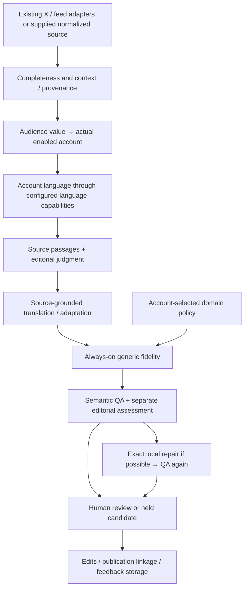

# Domain-agnostic core：审计与最小重构

这次先把冻结的 5 个回归和 12 个 held-out 输入送入真实评测，再动架构。17 条均留下状态，15 条发生模型请求，2 条在 source preflight 停止。共 42 次 relay 请求，33 次返回、9 次余额错误。最终 2 条机器 draft_ready，1 条 NONE，1 条 needs_review，2 条 needs_source，11 条 blocked。**金融质量验收没有完成，也没有将候选切为默认。**

用户已明确批准现有 koalaapi.com / claude-opus-5 的这批 payload；上一轮审批阻塞已解除。当前阻塞是 provider 账户余额不足，本地 $50 cap 未变。未充值、未换 provider、未修改生产账号、corpus 或队列。余额不足之后，本轮只继续了审计、本地最小重构和零模型预检。

所有真实稿与失败见 `runs/domain_generalization_v1/DRAFTS.md` 和 `EVALUATION.json`。本文件回答 architectural generalization 的 A–E；不把接口通过当作新 prompt 内容质量已通过。

## A. 当前哪些位置把系统锁在金融或旧假设里

| 实际文件/接口 | 审计前事实 | 判断与处理 |
|---|---|---|
| `live/distillation.py:account_profiles / route` | 路由本来就读取 enabled account ID，persona 只随 profile 传入；没有 macro/industry/trading schema enum | 已是正确骨架，保留，不再造 router |
| `live/distillation.py:account_profiles` | 无 domain/policy 选择，筛选后的 profile 丢掉未来 source/editorial preferences | 新增 domain、fidelity_policy、version 和两类可选偏好；不机械补全部示例字段 |
| `live/distillation.py:LANGUAGES / _run`、`distillation_source.py:source_record` | EN/ZH 集合、检测器和 orchestration 直接绑定 | 移到 `LanguageSupport` 能力配置；默认检测器仍仅 EN/ZH |
| `live/distillation_prompts.py:ROUTE` | 用 argument、bonds、market facts、useful analysis 描述价值，暗示必须是分析观点 | 改为对实际账号受众的信息价值：观察、方法、解释、例子、报告或论证；允许信息差价值，但不虚构受众“没见过” |
| `live/editorial_prompts.py:PLAN / QA / IDENTITY` | 通用保真与仓位、基金、Long/Short、market truth 等金融术语混合 | 通用原文选择、归属、推理与事实检查保留；金融专用条件进入 policy |
| `live/numeric_fidelity.py:METRIC / ALIASES` | revenue、margin、profit、policy rate 的词表在通用数值模块中 | 移到 finance policy，数值比较接受 metric_aliases；数量、范围、时间和公式仍是通用能力 |
| `live/fidelity.py:deterministic` | 原生产数字/金融指标/持仓提示与语言、实体、provenance 检查混合 | 保留原实现作为 finance policy 的兼容检查，核心不再直接导入它；通用检查始终运行，policy 只能增加检查 |
| `live/analysis_corpus.py:_row` | 会提取 ticker 作为附加 entities，但没有因无 ticker 丢弃输入；主 source 合约也不要求 ticker/revenue/margin | 不把存在金融 annotation 误报为金融准入门槛；保留既有 adapter annotation |
| `live/analysis_corpus.py:connected_rows / intake` | 订阅成员判定依赖 feed IDs 或 `x_` handle 形状 | 核心按 subscribed source_id 过滤；历史 X ID 映射留在 adapter 边界，支持显式 source_ids |
| `live/source_recovery.py:recover` | 以 `source_type != x` 决定是否尝试文章恢复 | 改用 adapter 的 body_recovery 能力。未知平台不能被自动当文章；现有 article labels 仅兼容老存档 |
| `live/production.py:summarize` | 报表写死 macro/industry/trading 三格 | 新增实际 account 统计，persona 统计按实际数据生成；不拿 persona 编排 |
| `live/production.py:source_first_pass` | 调用 account-based Pipeline，旁路旧 classifier；queue 已有 account_id/target_language | 保留，source normalization 改为使用 pipeline 的语言能力 |
| `live/analysis_corpus.py:classify_row / _pick_persona`、`production.py:hot_pass / evergreen_pass` | 大量旧金融 action/persona 代码仍在文件里 | 不在当前 source-first 出稿主链；保留隔离的旧业务/历史测试，不把它们全部“泛化” |
| `live/accounts.json`、source registry | 当前真实部署的内容、受众、source pool 都以金融为主 | 这是 domain/deployment 配置，不是必须删掉的架构耦合；文件未修改 |
| `live/editorial_evaluation.py`、反馈 API | case_id、account_id、source、text、versions 与 engagement dict 本来就没有金融 schema | 保留；修正“没有 routing 的两个预检也算一致”和未尝试样本的统计 |
| 金融 benchmark | 数据都是金融首个 vertical；评测器不要求金融字段 | 保留真实金融 benchmark，新增非金融合约测试；没有冒充 AI/consumer 真实质量 benchmark |
| 源/输出 | source 可以是长文本、文章、quote/thread/media context；输出是普通 text/segments，不要求 financial post 或 handle | 不新增万能 renderer。结构化图像/视频适配继续由未来 adapter 提供 |

审计前代码快照在 `runs/domain_generalization_v1/before/`，可以核对上述“审计前”判断；当前函数位置以本轮文件为准。

## B. 改成了哪些通用层，为什么



`live/domain_policy.py` 是一个小 dataclass 加 generic/finance 两个内置实例，没有自动扫描插件、ABC 层级或新 agent framework。Policy 包含标识、版本、语义审核指引、可选 metric aliases、可选 additive checks。账户 policy fingerprint 进入 profile/replay key；审核元数据保存实际 policy。空的 domain hook 也不能关闭通用语言、数值、实体、provenance 检查。

`live/language_support.py` 隔离支持语言集合、检测器和版本，source normalization、account validation 和 output checks 使用同一能力配置。未知语言仍停住。测试注入额外语言只是证明无需 fork pipeline；没有部署法语、日语等新能力。

Recovery 使用 `body_recovery=public_html/archive_only`，source 保留通用 platform、source_type、content_kind 与上下文。Feed/X 继续各用原适配器；未来一个 adapter 只要给出相同归一化 source 合约，就不需要重写 editor/writer/QA。

通用 routing 的主体是 audience、scope、source preferences 与 editorial preferences。没有新增“信息差指数”，也没有把“英文信息中文读者未见过”当默认事实。目标语言仍由 account 决定；persona 可以不填。

## C. 保留为 finance policy 的能力

`live/finance_policy.py` 保留 finance metric aliases、原生产 `fidelity.deterministic` 和金融语义检查要求：

- currency、规模单位、范围、percent/percentage point/bp、财年/期间和 metric/value 归属；
- 已有计算与新增推导的区别，包括不能因为可算就解释 4% 的由来；
- holdings/book、Long/Short、基金管理、收费、业绩归属；cashtag 不等于仓位披露；
- 金融预测的力度/不确定程度，不自动添加建议、风险提示或结尾。

数值、公式、比例和身份保护本身并不专属于金融，因此通用层也保留它们。金融 policy 加的是语境与词表，不是把非金融内容排除。

四个现有账号没有 domain 字段。为遵守不修改生产账号配置的要求，仅在 finance policy 内对四个**已知 account ID**提供兼容默认；不按 persona 名或关键词猜 domain。新账号应显式选择。未知 policy 会报配置错误，不能静默退到 generic 导致检查丢失。

保留金融规则不等于已证明模型输出不变。通用 prompt 和 finance policy 的拆分改变了实际 model input，已升版本；真实 before/after shadow 仍被 relay 余额阻塞。当前通过的是控制与合约测试，不是金融质量回归验收。

## D. 明天新增 AI/tech account 需要什么

下面是配置示例，不是新建或声称拥有一个账号：

```json
{
  "id": "your_actual_tech_account",
  "enabled": true,
  "lang": "zh",
  "platform": "your_actual_platform",
  "domain": "ai_tech",
  "fidelity_policy": "generic",
  "audience": "关注开发工具和技术机制的中文读者",
  "beats": ["developer_tools", "model_engineering"],
  "selection_scope": "Useful original explanations, observations and methods for this audience",
  "source_preferences": {"prefer": ["firsthand technical material"]},
  "editorial_preferences": {"preserve_worked_examples": true}
}
```

1. 配置真实 account 的受众、平台、语言、范围和 policy。使用已有 EN/ZH 能力时，不需要新增语言实现。
2. 增加获准的 source 配置，继续使用 feed/X 适配器；或提供现有合约的完整原文/上下文。没有强制 ticker、handle、交易观点或 finance persona。
3. 初期可**明确**用 generic policy。需要特定 model-version/benchmark/demo-versus-production 检查时，再定义一个小 `DomainPolicy`，通过 `domain_policies=[...]` 注入同一 Pipeline；不复制编排。generic 不代表已经完成 AI 领域专门 QA。
4. 在隔离 account 配置上运行同一个 runner 的 `--accounts path/to/accounts.json`，再做真实审核。这个 CLI 不改生产账号文件。

若扩出 EN/ZH 之外的语言，还需要配置并验证语言检测/审核能力；若新增尚无 adapter 的平台，还需要它的获取/正文提取适配器。这些是真实接入工作，不应该被“通用接口”掩盖。

## E. 有意没有泛化的部分

- 现有金融 source pool、真实账号受众、金融指标词表与金融研究工具：有明确业务价值，留下作第一 vertical。
- Finance-specific 的旧事件研究、persona 实验、Evergreen、donor 学习及历史报告：与新主链隔离；本轮不重写整个 repo。
- 默认 EN/ZH、一个 source 选一个 account、跨语言才搬的当前产品门槛：本轮不启用新语言、同语言跨平台或多账号 fan-out。
- X/feed 网络收集器：不增 Reddit/小红书/YouTube 等适配器；通用 core 接口已能容纳它们的规范化结果。
- 主体仍是文本加媒体依赖/上下文，未实现 OCR、视频字幕提取、认证/付费全文、平台专属排版。
- 没有实现 AI/consumer/gaming 的完整 policy、自动信息差评分、自动 fine-tuning、自动发布、vector DB 或动态插件系统。
- 人审、发布关联、表现快照已经通用；不因新增 domain 再建一套反馈服务，也不自动以 engagement 调整 writer 观点。

## 本轮真实失败如何处理

| Case | 实际结果 | 当前结论 |
|---|---|---|
| Duff | NONE，只 routing | 控制流正确；无 Trading owned account |
| SemiAnalysis | QA 在 JSON 外附加说明，严格解析 blocked；额外说明指出 NAND 开头没有回应 | 原稿与完整响应保留；不能截取 JSON 伪装通过，选段仍待修 |
| Nvidia | 一次局部 repair 后机器 draft_ready | 无擅加 4% 推导；末尾英语比喻仍需人审 |
| HAOHONG | 机器 draft_ready，无 repair | 正例保留；人工验收未发生 |
| Kova | 初稿 “For my positions” 身份冒用；QA 时余额不足 | 未修复；editor guidance 本身犯错，writer 未抵住错误指导 |
| H01 | needs_review | 修复利润率口径后仍有“原文如此”的审核口吻 |
| H02 | 空 output segment 导致 blocked | 未忽略无效段落后强行放行 |
| H03 | adaptation 时余额不足 | 有路由/选段，未出有效稿 |
| H04–H08、H10–H11 | routing 时余额不足 | 没有取得内容适配判断，不能计算语义通过率 |
| H09、H12 | needs_source，零模型调用 | 图表/主体转录缺失，正确停止 |

最初将 Semi 解析失败误诊为字面换行转义，随后逐字节检查确认是代码块外有实质审核说明。已明确纠正，没有放宽解析或丢掉额外内容。`model_json.py` 仍只接受单个 JSON object（可带完整 fence），外部说明会失败。

新增 typed provider quota failure 和 batch stop，避免同一余额错误继续对后续 cases 发请求。未尝试行不计入模型失败率；两个没有 routing 的 preflight 不算 routing 一致成功。

Shadow 工具可以从保存的 before 目录在独立解释器中运行原生产代码，避免把修改后的同一份默认代码冒充 baseline。已完成 H09/H12 的真实 source preflight 对照，两侧空正文、零模型调用；内容质量 shadow 尚未执行。调用 model 只使用原配置、原 budget，并保留所有日志。

## 后续验收边界

待现有 relay 余额恢复，先补齐缺失的模型 QA/失败案例处理，再做修改前生产 vs 本轮候选的真实 shadow。此前五例与已观察的 held-out 结果保留原身份及失败，后续重跑必须标作 follow-up，不能重置成首次全通过。新的 domain policy 没有非金融真实模型质量证据；本轮只用明确 TEST_DOUBLE 验证架构接口。

默认生产没有切到 candidate，没有执行发布、队列迁移、corpus 写入或账号配置变更。源码已发生通用化改动，未重启服务或自动推广；切换之前仍需要真实内容和人审证据。
