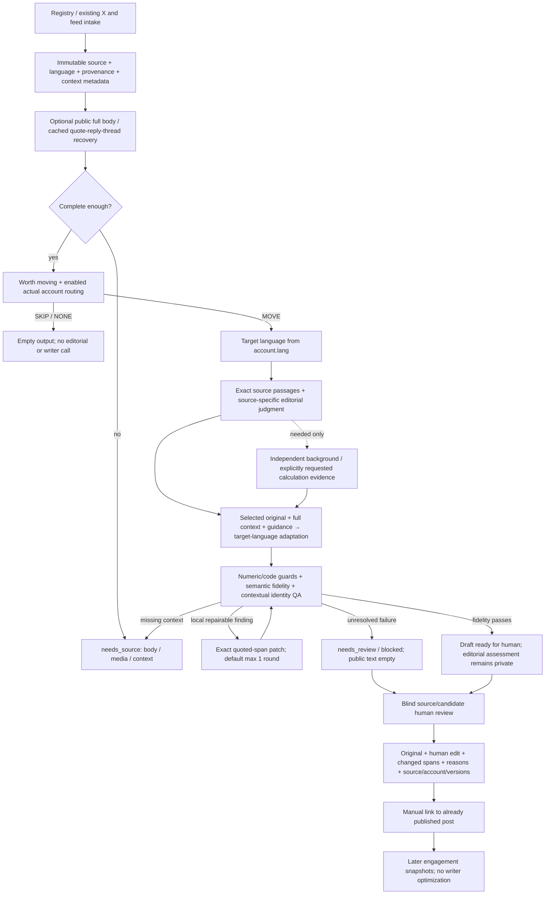

# Editorial completion v2 — 实现与证据边界

本轮补齐候选链的控制与反馈能力，没有切换生产默认。模型回归、held-out 质量评测和 paired shadow 尚未执行：自动审批两次拒绝向现有 relay 发送原文/账号筛选资料/prompt，要求用户明确确认目的地与 payload。请求已提出；没有换 provider、绕过拒绝、编造成稿或将 mock 当真实结果。

## 数据流

生产 `live/production.py` 仍调用 `Pipeline`：选段 → translation → exact light-edit patches → QA → 人审队列。候选 `EditorialPipeline` 显式运行，按用户接受的研究方向直接以原文加判断进行 adaptation，不强制逐篇产生一个 literal 中间版本。两条链没有交换母稿、迁移旧队列或自动发布。新增 audience 字段已进入共享 account profile；共享 source 合约会保留上下文并拦截明确缺失的依赖。

## 代码、语义判断和人工判断的边界

| 谁负责 | 本轮实现 |
|---|---|
| 确定性代码 | enabled account、account.lang、NONE 终止、来源 hash/offset、精确引用、数值单位/公式差异、patch 范围、轮数、只追加反馈、版本绑定 |
| 语义 QA | 身份归属、指标值绑定、因果/力度/条件、隐含算术、选段逻辑闭合、上下文是否必要、背景是否改变原意 |
| Editor | 值得搬的范围、不同 source 的处理力度、真正重复的内容、是否需要一个背景解释；不替换 source |
| 人 | 自然程度、节奏、比喻与细节价值、账号匹配、是否值得发布、平台/handle 的真实映射 |

Editorial prose assessment 没有通用分数或强制模板。温和的节奏偏好不使 fidelity 失败；空 guidance 是合法结果。正文不自动解释 QA 限制。

## 身份研究与处理

依据是本地真实 source，不用第一人称词表直接决定 attribution。下列分类供语义判断参考，不是要求 writer 填满的枚举。

| 语义 | 真实材料中的观察 | 应有处理 |
|---|---|---|
| 普通 opinion | Duff 认为管理方式比单策略更重要 | 保留力度；不必每句“作者认为” |
| personal holding | Kova 的“对我的持仓来说” | 必要的局部归属；末尾 cashtag 不能改成 Long 披露 |
| own book / portfolio | Duff 实际使用多个管理 agent、监控风险 | 可保留经验；不能成为目标账号的系统 |
| fund management | Duff 希望成为 professional manager | 愿望不能升级为已有基金/职业资格；若 source 真有基金，另核其归属 |
| personal experiment | 存档 xingpt `2094331717536588243` 的“我试了一下” | 归属其测试经验；不能变成目标账号亲测 |
| personal performance | 存档 Phyrex `2081671505981948167` 的测试时长、收益陈述 | 原样保留其自述性质、期间和数值，不冒充账号业绩，也不替作者核实盈利真实性 |
| fee structure | Duff 提到收取 performance fees | 不删除论据；收入/收费安排归原作者 |
| employment / role | Duff 在文末说明为 Darwinex 工作 | 如选入成稿，必须保留原作者雇佣归属 |
| proprietary estimate | SemiAnalysis 使用 InferenceX 方法估算成本 | 机构研究/方法归属需保留；不能伪称我们自己的研究 |
| firsthand observation | Duff 自述错误止损带来的交易经历 | 判断依赖经验时保留，并明确是谁经历的 |
| hypothetical example | Duff 的“假设我跑着十个策略” | 这是例子，不能误标成真实十个持仓，也不必机械重复作者名 |
| rhetorical first person | qinbafrank `2080596296017322482` 的“比我们想象的更快” | 泛指读者的 we，不自动触发 biography attribution |
| publication authorship | SemiAnalysis 提及先前 Kimi 文章 | 不能让目标账号声称发表过该文章 |

主 QA 必填 identity/calculation review；出现 I/my/we/我 等 cue 时追加独立 identity review。cue 只是召回额外 reviewer，不是语义结论。没有 cue 的第三人称、引语和机构归属仍由主 QA 审核。所有引用必须是实际 source/context/output 的子串。两次 reviewer 仍可能共同漏判；未做本轮真实模型验证，不能声称已解决所有身份错误。

## 数字与精确修复

`numeric_fidelity.py` 识别范围共享后缀、部分中英文数量级/货币、百分数与百分点、bp、日期月份、fenced 公式、简单指标绑定和 ratio/time 差异。可确定的新数值/单位及修改过的公式设硬拦截；重复数字、遗漏、未知单位和指标/ratio 变化交给语义 QA。它不是通用数学证明器；不覆盖所有数字词、会计写法或跨句指代。

“原文有 4%”和“解释 4% 怎样算出”是不同的 claim。数值集合无法验证后者，专门由 calculation review 核对。只有 editor 明确请求、具体说明必要性、提供原文 operand 引用，才可建立新增 calculation evidence；没有默认自动算数。单位/指标选择仍要语义检查，Decimal 运算正确不等于新观点合理。

Repair 只接受 finding_id + exact before/after；before 必须等于已报告的 output_quote，唯一落在一个段落内；不能改其他字符、删除整段、重叠替换或改变段落边界。默认一次，最多配置两次。每次重新执行全部 QA。选段错误、缺资料或根本论证问题不重新 planning。违规 patch 保存原响应、保留原稿并 block。不是所有错误都有自动修复：代码数值拦截自身不生成替换建议，需要可执行的语义 finding；repair 后使背景引用失效也会 hold。

## Source 和背景恢复的真实覆盖

Feed 优先完整 content 字段，保留 pre 代码块、图片 URL/alt 和链接；summary/description 不等于全文。X 保留 fullText/noteTweet、truncated、quote/reply/thread/media 元数据，不为未读图片填内容。

新增 `SourceRecovery` 仅抓配置过的公开 HTTPS host；有字节、超时和重定向限制。保存原始 HTML/hash，提取 article/main；付费墙/teaser 仍缺 source，纯文本响应默认完整性未确认。HTML 完整性判定仍是启发式，不是普适证明。没有 cookie、登录、付费墙绕过，也没有 OCR。

真实网络验证取回 SemiAnalysis 公开部分：21,341 字符、四个代码块、22 个图片记录；检测到付费后半段，正确标为 incomplete。第一遍沙箱 DNS 失败也留存。历史 Semi regression 的输入是之前补齐代码块的**已捕获公开范围**，extraction_status 明确写有未获付费部分，不应宣称拥有整篇付费全文。

存档 quote/reply/thread 分别保存 speaker，不并入原作者正文；支持显式 thread_post_ids，不会自动发现整个 thread。冻结 benchmark 实查：H12 找回一个 quote，但主转录仍缺失；H10 引用帖不在库；H09 缺图。H09/H12 与 8 条近期 intake 经过真实代码 preflight，10 条全部 needs_source、正文空、零模型调用。它们是预检结果，不是模型 benchmark 通过。

Background 只有 editor 认为读者离开这条背景就无法理解时才请求；依靠独立 catalog 的实际摘录或 allowlisted 公开网页。来源、快照、quote、why_needed 与 output_quote 单独记录。没有每篇搜索、固定三条背景或自动延伸观点。尚无真实模型触发 enrichment 的成功案例。

## 真实账号

| account_id | 语言 | 受众/范围 |
|---|---|---|
| zh_macro | zh | 看盘中文读者；货币政策、宏观、流动性和跨资产资金 |
| en_macro | en | 没看到中文讨论的国际读者；同类宏观范围 |
| zh_industry | zh | 关注供应链、成本、财报与原始披露的中文读者 |
| en_industry | en | 从另一语言看公司基本面、产品与供应链的国际读者 |

四个都 enabled 并进入 routing；此前遗漏的 audience 现已传入。没有新增或启用账号。实际 platform/handle 都没有配置；formats 列表不构成 owned account 证明。文件有 macro/industry/risk persona，accounts 另列 unassigned trading；均不能代替真实账号。需要用户确认平台/handle，以及是否真的有 Trading 账号及语言/受众。Duff 的 NONE 控制仍应保留。

## 人审与发布反馈

`FeedbackStore` 追加保存：机器原稿、修复前原稿、人工稿、逐字 spans、原因/自由标签、approve/reject/save、source/account/editorial judgment、pipeline/prompt/version。稿件版本变化必须重新审；不替用户产生真实标签。edit distance 使用 `1 - SequenceMatcher ratio`，不是质量分数或 Levenshtein。

页面 `/localization-review` 对照原文与匿名候选，提交前隐藏方法/QA，提交后显示机器记录。实际 FastAPI 路由和 API 经测试；没有浏览器视觉验证，也没有重启现有服务。新评测尚无候选，当前列表为空；runner 写隔离盲审包，实际登记可 POST `/api/localization-review/register`，提供允许目录内的 metadata.json 路径。没有偷偷把历史失败稿登记成新候选。

发布链只记录人工确认已发布的帖子：approved review → draft_id/version → account/platform/post_id/time → later metrics + observation time + provenance。不是发布器，也不是平台自动采集。真实人审/发布/指标目前均为 0。没有自动训练、排序回灌或 writer 风格优化。

## 评测、失败与 rollout

五个历史 source 固定为 development regression（旧 role 字段保留历史身份，以 split 字段为准）：Duff NONE、Semi 选段/发表身份、Nvidia 无根据推导、Kova 冒用持仓/Long、Hao 正例。原失败文本和路径保留，不以修订后测试替换历史。

12 条新真实源在 prompt 修改前冻结。覆盖双向长短、industry/macro/trading/crypto、identity、skip、chart/context。长样本主要是 X 长帖，**不是**新的完整 newsletter 长文 benchmark；未来应补独立长文和非同作者测试。只验证本地已有 adaptation 调用记录中未见 ID/正文前缀；它们可能参与过 corpus/classification，不是模型预训练、作者或全球会话 holdout。

本轮真实模型调用为 0，五例修复稿、12 条模型 fidelity/editorial 结果、paired shadow 均未生成，字段为 null/not_run，不填 0% 错误率。当前与候选 runner、code/input hash、精确输出、全部 status/failure、盲审键分离、统计已实现。不得拿候选自己的 QA 当 human acceptance。

近期已有 intake 冻结 8 条，全部旧 schema 无 completeness 证明。没有采集新 X、没有改 source pool。现有 twitter CLI/Apify 的历史授权与 skills.lock/Xquik 状态存在多处不一致，本轮不依赖新 X 请求；不能宣称新 thread 采集已经接通。

切换条件仍待真实对照和人工选择；当前默认不变即 rollback 边界。没有部署开关、自动升版或队列迁移。文件修改前快照与 SHA 清单在 `runs/editorial_completion_v2/before*`，最新文件清单和保护数据核对见 `verification.json`。

## 尚未做、仍不值得此时扩大的部分

- 新平台/日韩语言/其他 vertical、同源多账号 fan-out：用户明确本轮只考虑；当前一源一账号、EN/ZH，不伪装通用多语能力。
- OCR、自动 thread 搜索、登录/付费全文抓取：目前返回缺依赖；等实际占比和授权后再选适配器。
- 自动背景搜索和性能采集：已有保守 evidence/API 接口，先积累真实必要请求及人工反馈。
- 自动学习 routing/treatment：先留标签及效果关联，防止把 engagement 变成更强硬、更 clickbait 的奖励。
- Vector DB、agent framework、复杂聚类、知识图谱、fine-tuning、自动发帖、固定模板、AI 检测/通用 style 分：当前没有证据证明它们解决本轮失败。
- 未完成的新模型回归/holdout/shadow **是审批阻塞，不是认为不值得做**；解除后必须完成，不能以本地测试代替。

产品更大方向保留为 source selection + actual audience routing + language/platform adaptation + editorial judgment。来源/账号/语言/平台和 provenance 已分字段；不为“通用”提前创造金融之外的采集和账号结构。
