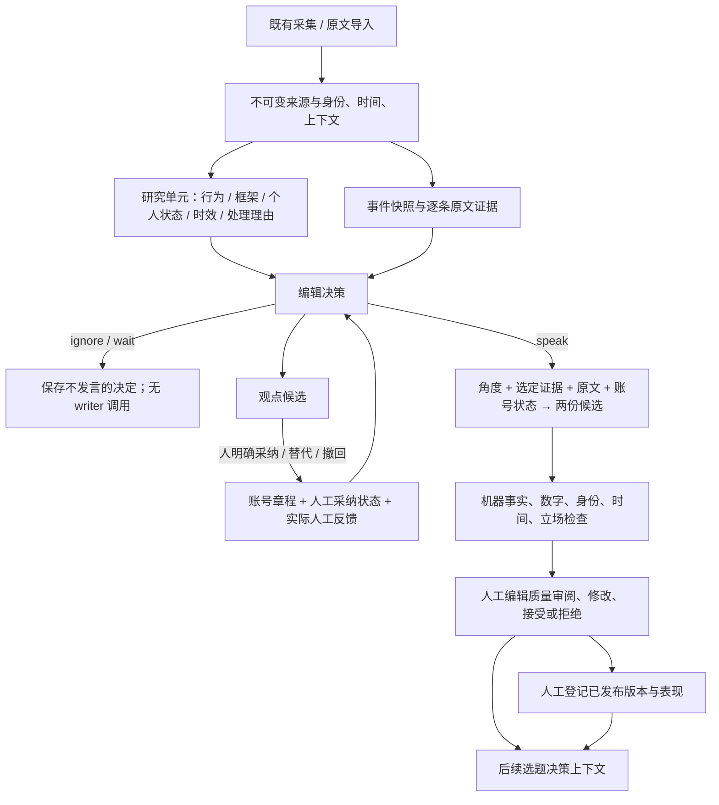

# 账号与事件工作台：使用与验收

> **当前说明为旧实现记录。** 2026-09-30 用户已纠正为“账号 → 自己的信息源 → 自己的候选”。请以 [三个账号的信息世界与 source discovery 计划](ACCOUNT_SOURCE_UNIVERSES_PLAN.md) 为当前提案。下文全账号事件评估命令与事件优先页面不应继续扩展或用于下一轮批量出稿；先确认三账号来源设计。本轮只修订文档，运行时仍是下文所描述的旧实现，尚未宣称已完成切换。

新入口：<http://127.0.0.1:8684/account-intelligence>。原翻译与历史评估页仍在 `/content-dashboard`。

这条路径处理的是“这个账号是否值得对这个事件发言”，而不是把每一份 source 变成一篇稿。它是独立的本地开发/人审路径，尚未替换生产任务。

## 数据流与真实边界



- **原文**：不可变文本，保留来源日期、采集日期、作者与平台关系、原始导入引用、缺失字段和 hygiene 注释。生成不是清洗原始库的理由。
- **研究单元**：精确原文范围与私有注释。模型给出的 durable / transferable 仍是待审判断，不等于已验证事实。保留被判为需要上下文或不适合复用的部分供审查。
- **事件证据**：逐项带 exact quote、来源、period、known-at 与 role。`primary` 表示来自导入的原始发布机构材料，不表示系统在今天重新做过独立验证；`reported_claim` 和 `historical_framework` 不能偷换成当期公司事实。
- **时间**：回放不能使用在 `as_of` 之后才采集的证据，也不能读取之后才被人采纳的账号观点。研究分析可以在今天对历史文本进行，但不得据此杜撰当时触发事件或历史沉默。
- **账号状态**：五份章程是明确的启动假设。只有人工 `adopt` 进入状态，`supersedes` 保存观点变化，`retract` 撤回。模型提出、通过机器检查、人工接受一篇文章、登记发布，均不会自行采纳观点。
- **反馈**：实际人工发/等/忽略决定和文章审阅进入后续决策；表现数据携带来源和时间作为参考，不自动优化语气强度，也不推断因果。
- **QA**：机器判断与保守数值/身份规则可能漏报或误报。它们不是人类质量验收。编辑后的正文不继承旧稿的机器 QA；批准时需填写实际核对说明。机器 hold 的稿件也只能在真实人工核对并说明后接受。

## 在 dashboard 中审阅

1. 选择事件，查看完整原文、逐条证据和信息截止时间。五个账号都会显示实际决定，未运行不会被记成“忽略”。
2. 打开某个账号的候选稿。正文与私有指导、证据绑定、风险、机器结果分开显示。
3. 记录“应该发 / 等证据 / 忽略”的实际判断与原因。文章本身另评母语表达、例子、节奏推理、账号一致性、角度价值；修改稿件后保存、接受或拒绝。
4. 研究单元也可以单独改判为可研究、需归属、不复用或仍需上下文；解除上下文缺失时，补充证据必须实际进入新事件。随后在“观点候选与变化”里单独决定是否把框架或观点采纳为账号状态。可以手动提出状态，或用新状态替代旧状态。接受一篇稿子不等于永久认同其观点。
5. 状态变更后，使用“按当前账号状态重评”。这会生成有父记录的新回放，保留原稿；旧版本批准不能自动迁移到新版本。
6. 真正在平台发布后，登记已有 Post ID、时间与链接；系统要求与已批准正文同版。之后可登记真实表现快照。工作台不执行平台发布。

本地 reviewer 字段是自行填写的人类身份，没有声称实现用户认证或远端发布验证。

## 命令与外部执行

在 repo 根目录，使用 `.venv/bin/python -B`：

```sh
# 创建此次真实存量材料 fixtures（幂等，不重新采集网络内容）
.venv/bin/python -B -m scripts.run_account_intelligence seed
# 研究单元提取：真实 relay 调用，完成的原文/版本不重复调用
.venv/bin/python -B -m scripts.run_account_intelligence research
# 指定案例与账号；省略 account 会逐个评估五个账号
.venv/bin/python -B -m scripts.run_account_intelligence run --case F01 --account zh_macro
# 有意跟进时保留父 run 身份；默认跳过已经运行的 event/account
.venv/bin/python -B -m scripts.run_account_intelligence run --case F01 --account zh_macro --follow-up-of RUN_ID
# 重建审阅输出，不改人审数据库
.venv/bin/python -B -m scripts.run_account_intelligence packet
# 读取已有新闻库的少量 discovery candidates，尚不作完整事实证据
.venv/bin/python -B -m scripts.run_account_intelligence news --limit 3
# 导入新的不可变事件版本及其原文
.venv/bin/python -B -m scripts.run_account_intelligence import-event /absolute/path/bundle.json
```

`import-event` 接受 `{"sources": [...], "event": {...}}`。来源字段见 `captured_source`；事件字段及 exact evidence 见 `seed`。事件证据引用 bundle 中的 source id，导入时转为内容版本 ID。研究库关联使用 `research_source_ids`；不会把整个 donor 库无差别塞进 writer。RSS 标题/摘要只进入候选池，缺全文和证据时终止在 wait。需要补齐材料后另导入同 family、较新 as-of 的版本。

本次机器的本地代理不可连接，因此实际评估进程临时使用 `env -u HTTP_PROXY -u HTTPS_PROXY -u ALL_PROXY -u http_proxy -u https_proxy -u all_proxy` 前缀。没有改 `.env`、模型、远端、预算上限或全局代理设置。失败请求的保守预算预留照常保留。

## 人工数据与训练

`GET /api/account-intelligence/learning-export` 只导出真正录入的人工决策和非草存审阅。每条包含事件快照、账号状态、标签时间、事件/来源分组。没有人工标签时导出 0 行。

这是监督数据出口，**不是已经训练出的账号行为模型**。下一步评估应按事件时间划分，保证同事件/同来源族不跨训练与测试集。先观察实际人工审阅中的重复错误，再判断检索、提示、标签或训练哪一项值得改；暂不训练 LoRA、SFT 或 DPO。

## 本轮没有假装完成的东西

- 全历史 KOL 语料的事件、当期新闻/价格重建：本轮只使用少量已捕获材料，无法把缺失帖子当成“刻意不评论”。
- 对任意新 URL 自动恢复全文/图表、验证所有事实并补齐市场价格：当前 discovery 会明确 wait；原系统的恢复能力未被伪装成通用事实核验。
- 自动从整库学习独特账号风格、长期立场和反应分布：需要真人判断与足够的连续观测。当前实现的是可记录、可回放、会消费真实反馈的基础流程。
- 信息差/独家性的证明：双语或没有搜索结果不能证明独家价值。
- 平台绑定、定时生产、发布动作、表现因果归因、任何训练或线上切换。

这些是后续数据与产品验收，不应靠新增基础设施名称来宣称完成。
