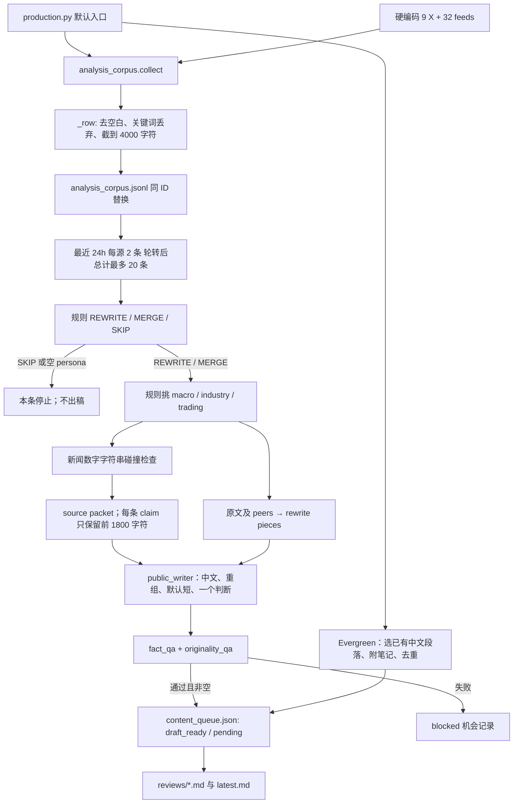
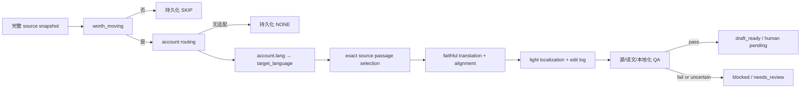

# Content distillation pipeline 审计（2026-09-29）

**结论：当前默认链路是“订阅内容筛选 → 三个人设之一 → 重组判断、压短的中文写作 → 很有限的 QA → 文件审核队列”。它还不是账号驱动、双向跨语言、translation-first 的 localization pipeline。**

关键问题不只在提示词：原文在进入 writer 前已经截断；实际账号及其语言没有接进主链；QA 允许新增判断、丢失原文信息，也不校验输出语言。只替换模型、加“忠实原文”一句话或继续调文风，不能修复这些接口问题。

本审计以本次用户的 16 条目标为准。仓库里要求“原创分析”“不逐句翻译”“每个人设独立提出判断”的旧文档，不作为否定本次目标的依据。

## 审计边界与证据

- 检查了第一方执行入口、调用关系、采集/存储/分类/写作/QA/队列代码、账号配置、前后端读取位置、相关实验及测试。历史第三方 checkout、venv、模型权重、缓存、原始书籍不当作生产代码；旧产物只作历史运行证据。
- 当前目录没有 `.git`，不存在可以核对的 HEAD。代码 SHA-256 清单、数据快照哈希、离线探针结果和一个**由当前代码实际组装出的完整 system/user messages 样例**，保存在 [offline_evidence.json](/Users/fionama/Desktop/Crypto/Mango_Works/Finance_Distillation/docs/audits/2026-09-29-distillation/offline_evidence.json)。该 prompt 样例使用合成材料，未发送给任何模型。
- 只读原有数据；没有新采集、付费调用、生成或全量重跑，没有修改生产代码、旧产物、队列或审核答案。新增内容只有本审计目录。
- 快照时间：2026-09-29 10:20 UTC。`analysis_corpus.jsonl` 有 220 行，其中 57 行正文长度恰为 4,000 字符；代码可证明存在截断，单靠长度不能断定每条原文究竟长多少。`content_queue.json` 有 148 条机会，37 条 `draft_ready`；其中标记 `source-first` 的 26 条，10 条 ready、16 条 blocked，**0 条有 account_id，0 条有 target_language，14 条 audit 有 original**。
- 当前代码配置是 **9 个 X + 32 个 feed = 41 个订阅通道**，来自 `analysis_corpus.py` 中的常量，不是文档里写的 44 或 9+30。当前磁盘队列最后更新时间为 05:00 UTC；writer 文件之后还有修改。因此不能把这些旧稿说成当前 prompt 的新验收结果。
- 当前 relay 配置的 host 为 `koalaapi.com`，模型别名为 `claude-opus-5`。这证明的是配置标签，不能独立证明中转实际模型身份或今天通道可用。本次未调用远端验证。

## A. 当前真实 pipeline

### A1. 默认入口与真实数据流

入口：[production.py:1427](/Users/fionama/Desktop/Crypto/Mango_Works/Finance_Distillation/live/production.py:1427) `main()`，默认执行 [run_once():1341](/Users/fionama/Desktop/Crypto/Mango_Works/Finance_Distillation/live/production.py:1341)。默认 `ingest=False` 指的是不刷新新闻；**分析源 ac.collect() 仍会执行**。默认最多处理 20 条 intake 候选，另外会运行最多 2 个 Evergreen 主题的选择。



**这条主路径中没有独立的 LLM summarize、editor brief、translator 或 localizer。** `production.summarize()` 汇总运行指标，不总结文章；RSS 的 `summary` 是上游 feed 字段，不等于 LLM 摘要。`rewrite_from_matches()` 的“main_thesis”是标题或开头 180 字符，其他推理字段为空，也不是 LLM 提炼。但它仍把任务定义为“重组写作”，而不是忠实翻译。

| 步骤 | 文件 / 函数 / prompt | 输入 | 输出 | LLM / 模型 | 下游怎么用 |
|---|---|---|---|---|---|
| 1. 订阅轮询 | [analysis_corpus.py:316](/Users/fionama/Desktop/Crypto/Mango_Works/Finance_Distillation/live/analysis_corpus.py:316) `collect` → `fetch_feed` / `fetch_handle` | `PRIORITY_FEEDS`、`PRIORITY_HANDLES`；旧 corpus | RSS/Atom 最近 6 条、每个 X 最近 8 条；notes、added | 否；curl/XML 和 twitter CLI | 新旧行合并，保留新采集结果；不是完整分页或可靠增量补采 |
| 2. 内容抽取/入库 | [analysis_corpus.py:209](/Users/fionama/Desktop/Crypto/Mango_Works/Finance_Distillation/live/analysis_corpus.py:209) `_row`，235 `_text_of` | title、text、author、time、URL、source_type | `id, source_id, author, published_at, title[:240], text[:4000], url, entities, source_type` | 否 | 折叠换行、去 HTML；低于 40 字符或命中 `_DROP` 直接消失，无原始快照/排除记录 |
| 3. 保存/去重 | [analysis_corpus.py:160](/Users/fionama/Desktop/Crypto/Mango_Works/Finance_Distillation/live/analysis_corpus.py:160) `_rid`；188 `save` | source_id、URL、title/正文开头；全部 rows | `analysis_corpus.jsonl`，同 ID 后来行替换先前行 | 否 | ID 是定位键的 SHA-1 短值，**不是原文内容 hash**；原文更新没有版本记录 |
| 4. 候选 intake | [analysis_corpus.py:674](/Users/fionama/Desktop/Crypto/Mango_Works/Finance_Distillation/live/analysis_corpus.py:674) `intake`；896 `classify_latest` | 已连接源、时间、每源限额 | 24h 内每源最多 2 条，轮转后 `[:n]`；默认 n=20 | 否 | 缺时间的行被略过；这里只做时间/配额筛选，不检查“已经处理过” |
| 5. 值不值得处理 | [analysis_corpus.py:823](/Users/fionama/Desktop/Crypto/Mango_Works/Finance_Distillation/live/analysis_corpus.py:823) `classify_row` | title+正文；整个 connected corpus 作 peer window | `action, reason, persona, peers` | 否；regex | 广告/生活/太短/无特定判断词 → SKIP；同主题、另一作者、72h 内的判断 → MERGE，否则 REWRITE |
| 6. 人设选择 | [analysis_corpus.py:802](/Users/fionama/Desktop/Crypto/Mango_Works/Finance_Distillation/live/analysis_corpus.py:802) `_pick_persona` | 本条和 peers 的词汇 | `macro / industry / trading` | 否 | 关键词计数；没有命中时按 ticker/篇幅回退，最后默认 macro；不会返回无合适账号 |
| 7. 终止/重复处理 | [production.py:810](/Users/fionama/Desktop/Crypto/Mango_Works/Finance_Distillation/live/production.py:810) `source_first_pass` | action、persona、`events['src:'+id].wrote` | skip / already_written / 继续 | 否 | SKIP 或空 persona 真正 continue；只有已 ready 才设置 wrote，blocked 可反复尝试 |
| 8. 数字“核对” | [production.py:740](/Users/fionama/Desktop/Crypto/Mango_Works/Finance_Distillation/live/production.py:740) `verify_cited_facts`；[analysis_corpus.py:933](/Users/fionama/Desktop/Crypto/Mango_Works/Finance_Distillation/live/analysis_corpus.py:933) `cited_fact_queries` | 主帖最多 6 个数字短语；本地最后 400 条 news | `span, supported, news_source, news_url, news_text[:240]` | 否 | 完全字符串或纯数字串匹配；不对实体、时间、币种/量级/指标；miss 只写 note，不停止；peers 没有独立走这一步 |
| 9. writer/QA 输入分叉 | [production.py:682](/Users/fionama/Desktop/Crypto/Mango_Works/Finance_Distillation/live/production.py:682) `_source_packet`；777 `_rewrite_pieces`；[analysis_corpus.py:542](/Users/fionama/Desktop/Crypto/Mango_Works/Finance_Distillation/live/analysis_corpus.py:542) `rewrite_from_matches` | 主帖及最多 4 peers、checks | packet: `primary_facts, source_views, event_id, retrieval_basis`；pieces: `source, author, url, main_thesis, original_text` 等 | 否 | writer 获得入库正文，通常最多 4000/条；QA 的每条 source_view.claim 仅 1800。论证字段存在但为空。没有原文选段边界 |
| 10. 正文生成 | [production.py:936](/Users/fionama/Desktop/Crypto/Mango_Works/Finance_Distillation/live/production.py:936) `write_hot_draft` → [public_writer.py:137](/Users/fionama/Desktop/Crypto/Mango_Works/Finance_Distillation/live/public_writer.py:137) `messages_for` / 193 `write_public` | packet、三选一 persona、`_angle_for`、fact_pack、rewrite；cache={} | `text, model, provider, fell_back, persona, angle_in, sources_used, prompt` | **是，relay 的 WRITER_MODEL；当前 alias claude-opus-5** | SYSTEM + PERSONA + user task；一次请求，默认 max_tokens=900，temperature=.4。没有 translation 中间稿 |
| 11. 完成请求 | [writer_backend.py:62](/Users/fionama/Desktop/Crypto/Mango_Works/Finance_Distillation/live/writer_backend.py:62) `complete` | system/user messages、config | text、model、provider、usage | 是，同上 | HTTP /chat/completions；当前调用明确 backend_name='relay'，失败不会自动回退本地。finish_reason、response id 被丢弃；usage 在 write_public 又丢失 |
| 12. QA | [draft_from_packet.py:355](/Users/fionama/Desktop/Crypto/Mango_Works/Finance_Distillation/live/draft_from_packet.py:355) `fact_qa`；393 `originality_qa` | 生成 text、`lang='zh'` 的包装、packet | findings/status；最终 content_status | 否 | 查部分具体事实字符串、少量方向反转、同语言复制/推广/外链。**没有事实覆盖率、观点保真、身份、语言或语义对齐检查** |
| 13. 审核队列 | [production.py:860](/Users/fionama/Desktop/Crypto/Mango_Works/Finance_Distillation/live/production.py:860) `_opportunity` / `_push`；[queue_store.py:48](/Users/fionama/Desktop/Crypto/Mango_Works/Finance_Distillation/live/queue_store.py:48) `save` | 结果、部分 provenance、QA | `opportunity_id,type,persona,text,draft_status,qa_status,review_status,...,audit` | 否 | ready 正文写队列；当前代码 blocked 正文置空。source_packet 是引用字符串，主链没有把这个完整 packet 持久化成独立文件；audit.original 又截到 1800 |
| 14. 交付 | [production.py:1214](/Users/fionama/Desktop/Crypto/Mango_Works/Finance_Distillation/live/production.py:1214) `render_backlog`；1249 `render_review` | queue、当轮记录 | `reviews/<stamp>.md/.json`、`latest.md` | 否 | 人工挑稿；正文与 audit 字段结构上分离，但报告额外显示 persona/来源。没有自动发布和发布后数据回收 |

主链没有按目标账号出稿；输出 `persona='trading'` 时也没有对应账号保障，现有 [accounts.json:191](/Users/fionama/Desktop/Crypto/Mango_Works/Finance_Distillation/live/accounts.json:191) 甚至明确 trading 未分配账号。

### A2. 另外几条必须区分的路径

| 路径 / 接通程度 | 实际数据流、模型、产物 | 与默认主链的关系 |
|---|---|---|
| **Evergreen，默认仍接通** | [production.py:1127](/Users/fionama/Desktop/Crypto/Mango_Works/Finance_Distillation/live/production.py:1127) `evergreen_pass` 从 `evergreen/lane/2026-09-27-ten.md` 取已有主题段落，按 cooldown 和 family 选择，附 candidate 说法；无 LLM；写同一个 content_queue | 不是本轮 source→translation 的结果。未重复时直接 `qa='passed'`，没有执行正文 fact_qa/originality_qa。`run_once(write=False)` 也仍会调用它，不能把 write=False 当整个运行零写入 |
| **`production.py --events`，显式辅助入口** | [production.py:1462](/Users/fionama/Desktop/Crypto/Mango_Works/Finance_Distillation/live/production.py:1462) `_run_events` → news.collect → load_rows/rank_events → `event_packet.detect_live_events/live_hotness/retrieve/packet_from_live/select_live_angle` → `hot_pass` → ac.match_event，必要时 search_event → 相同 public_writer → 相同 QA/queue | news 来源 lang/hash/time 更完整；“事实”来自正文抽句而非全文翻译。每个有 admitted facts 的事件默认让 3 persona 都 interested；`persona_views.consider()` **没有被调用**。`fetch_bodies=False`，依赖提前 `--prepare` 的 body cache；准备阶段最多 6000 字符、前 4 句各 500 字符。分析匹配再截 1800 字符。正文只有 relay LLM，事件判断为规则 |
| **`live/daily.py`，仍可独立运行的旧入口** | [daily.py:64](/Users/fionama/Desktop/Crypto/Mango_Works/Finance_Distillation/live/daily.py:64) → collect posts/engagement → hotspots → opportunities.assign → resolve_event → write.build → distinctness → `live/store/queue.json` | **这条才读取 accounts.json 的四账号及 lang**。resolve_event 用 Exa/Jina + regex 数字抽取；write 用 slots、persona 问题、donor 样例及 opinions 写独立分析。默认 local Qwen3.5-4B（modern lock），可显式指定 ml.writer_api 模型；中文 reader QA 默认另调 `relay2/claude-sonnet-5` judge。旧 queue 磁盘时间 2026-09-09；后续实验仍可单独调用 write。不能把它的能力算给新的 production.py |
| **旧 live writer 的前置断点** | [write.py:793](/Users/fionama/Desktop/Crypto/Mango_Works/Finance_Distillation/live/write.py:793) 检查 source_rank、双语 subject 标签、至少 3 个 slots；不足则退出。`label_facts.py` 有 LLM 标签器，但 daily→resolve→write 没有自动调用它。cross_language_gap 还要求预先生成双侧 crosslang 文件 | 即使手动运行旧 daily，模块齐全也不代表自动跑通；不要为新目标恢复这条事实槽写作链 |
| **`content/crosslang.py`，独立旧实验** | [crosslang.py:412](/Users/fionama/Desktop/Crypto/Mango_Works/Finance_Distillation/content/crosslang.py:412) `build(zh_draft, packet)` → en_slots → local Qwen3.5-4B → audit/alignment → `content/crosslang` | 输入是**我方已生成的中文稿**，写死 zh→en，必须补至少一条 background；不是外部 source 双向翻译。没有被 production/daily 默认链调用；UI 可以读取它的旧产物 |
| **`live/crosslang.py`，统计工具** | `gather/analyse/as_slots` 统计两侧帖子、词汇、先后与覆盖差异；无翻译 LLM | 旧 live.write 的信息差内容线使用它；名字 crosslang 不代表 translator |
| **persona_views / draft_from_packet** | [persona_views.py:124](/Users/fionama/Desktop/Crypto/Mango_Works/Finance_Distillation/live/persona_views.py:124) consider/revise 可调用 modern 本地模型产 angle/interpretation；[draft_from_packet.py:178](/Users/fionama/Desktop/Crypto/Mango_Works/Finance_Distillation/live/draft_from_packet.py:178) compose 用规则拼句；其 `_draft_lang()` 能按 source lang 反向选语言 | 当前 production 只用 pv.VIEWS 和 dw 的 QA；不走这些 persona LLM 和反向语言逻辑。compose 还有特定事件硬编码文本，不能复用为翻译器 |
| **旧 `content/` / evidence-loop / backend** | generate_slotted→packages/visuals/reactivation/crosslang，以及 evidence_loop 的独立 plan→draft 实验，有真实文件和调用记录 | 不是当前主链。backend `/api/generate` 受 `acceptance-state.json` 的 false 开关阻断；旧 generate()/guarded() 的 plan prompts 不能冒充默认生产 prompt |

还有几处会影响真实运行的接线细节：

- `intake()` 注释称取“未处理”内容，但它不读 queue；先限每源2条/总20条，后面才跳过 wrote。这会让已写条目反复占候选名额，也可能让较早未处理条目一直没有机会。
- source-first 没有调用 `_near_duplicate`；MERGE 的 peers 未作为已消费 source 建立幂等关系。辅助 --events 虽调用去重，却比较当前被置为空串的 `interpretation`，不比较实际新稿正文。
- `_source_packet` 和 `write_hot_draft` 注释把“分析帖子”与 admitted facts 分开，但 `fact_qa` 实际把所有 `source_views.claim` 拼进数字白名单。因此“只有外部核对成功的数字才允许进入正文”并没有被代码执行。
- 新 X 适配器跳过 retweet，但没有保留 quote/reply/thread 关系和稳定作者ID；feed 的 author 来自配置而非文章 byline。后台名为 author 的值不能自动视为已验证的逐篇原创作者。

代码没有内置已部署 scheduler：main 默认一轮，也支持有限 `--cycles/--interval`。未检查主机外部调度器，不能声称它目前在持续后台服务，也不能仅凭 collect 函数声称已完成持续采集。

## B. 当前已有能力：可以保留到什么程度

| 能力 | 实际证据与接通状态 | 保留判断 |
|---|---|---|
| 英中 source ingestion | 当前 ac 会抓中文 X/公众号 feed 与英文 X/feed；已存在实际 corpus | **保留适配器**，补完整正文、分页/游标、来源版本、错误持久化；不能称持续完整覆盖 |
| source registry | 文件存在，但 `ac.REGISTRY/RESEARCH` 只是常量，默认 collect 读硬编码 PRIORITY 列表 | 保留配置资产，改成实际唯一订阅入口；避免 UI/文档以 registry 行数当活跃源数 |
| account profiles | 四账号 `id/lang/persona_id/beats/audience` 已配置并接在旧 daily | **可直接复用数据结构**；必须接到新的 routing；不能沿用“始终独立创作”的旧约束 |
| 人设 | 新主链三段人工说明 + 规则选取；旧 donor profile/权重/样例不在新 prompt 中 | 保留账号适配描述，移除新增分析角度与模板要求；不需要恢复 donor 训练 |
| classification | REWRITE/MERGE/SKIP 规则真实运行；SKIP stop 有效 | 复用便宜过滤与 reason 记录，换掉输出契约；不能把正则命中算语义价值判断 |
| source storage | 真实 JSONL；同 ID 更新、部分作者/URL/时间保留 | 改造为 raw snapshot + normalized working copy；当前不满足 immutable provenance |
| dedup | 当前有 ID 去重、wrote 标记；旧 news 有 URL/hash；cluster 有向量/裁判实现但当前 source-first 不调用 | 保留定位/哈希工具；补 source+version+account 幂等键与候选去重，暂不需要复杂聚类 |
| language detection | 旧 collect 有 lang_reported/watchlist_lang；crosslang/originality 有 CJK 比例判断；新闻有配置 lang | **局部存在，主链缺失**。CJK 比例只能粗分，其他语言/混合文本不能一律当 en |
| content extraction | ac 解析 RSS HTML；production 有正文 cache/Jina 抽句；resolve_event 有原文/blocks | 可改造原文获取。source-first 没用补全文；“前几句”不等于 passage selection |
| provenance | source author/URL/time、queue.audit；旧 resolve/ledger 还有 hash/span | 保留现有审计字段和 ledger 思路；不是完整源→选段→译文对齐 |
| 数字/实体 QA | 当前只有字符串规则；`qa/gates.py`、render_slots、comparison 在旧链有更好解析与单位检查 | 保留纯函数并改造；不能全盘恢复 3–4 数字、固定句数等旧门槛，也不能直接把旧 2% 数值容差当严格保真 |
| publish/review queue | content_queue 原子替换写文件，ready 与 blocked、人审 pending 分开 | **保留存储和报告**；这是审核队列，不是完成的发布系统 |
| 产品 UI | [backend/assets.py:40](/Users/fionama/Desktop/Crypto/Mango_Works/Finance_Distillation/backend/assets.py:40) 读取 content/drafts 与 live/store/drafts，且要求 sentence_to_source_ledger | 新 content_queue 未接 UI，不能把浏览器里的旧稿件库当新主链交付 |
| feedback / analytics | ml/human_review 真实处理旧 drafts 的盲评；collect 的 engagement 是 donor 数据 | 保留人工评分工具；它不读取新 content_queue。没有“我方已发布帖表现→routing/selection”的闭环 |
| 视频 / Evergreen 语料 | 有字幕/segment、抽取原则及旧生产产物 | 保留数据资产；视频没接新 source-first，Evergreen 默认插入旧正文也不是本任务的翻译能力 |

## C. 和目标 pipeline 的 gap analysis

“接通”均指 **production.py 默认 source-first**，不以其他脚本有同名模块作为完成。

| 目标能力 | 当前实现 | 是否正确接通 | 问题 | 应该如何改 |
|---|---|---|---|---|
| Source selection | 24h/每源2条 + 判断词/广告词 regex | 部分 | 没有价值/完整性/账号受众判断；无词的真判断可 SKIP；“订阅收入”可被整条丢掉 | 规则只作前筛；worth_moving 明确决定，保留拒绝原因；先确认足够正文 |
| Account routing | `_pick_persona` 三选一 | 否 | 不是选实际账号；必有默认落点；trading 没配置账号也可出稿 | 候选来自 enabled accounts；输出 account_id 或 NONE |
| Target-language routing | prompt 和 QA 固定 zh | 否 | 现有 accounts.lang 未消费；无正式路由字段 | routing 后由账号配置确定 target_language，并严格校验 |
| Cross-language translation | writer 可读 EN 并写 ZH | 部分表象 | 英→中是生成任务副作用；中→英主链不可指定；没有翻译契约 | 两个方向统一接口，语言由 account 决定，不由 source 默认继承 |
| Passage selection | text[:4000]/claim[:1800] + writer 自己“挑一个” | 否 | 不可复现范围；段落边界消失；推理/限定可能在尾部 | full source + 精确 spans + selection reason + dependency coverage |
| Translation | 一次中文重写 | 否 | 没有忠实译文中间产物 | translator 输入选中原文和源/目标语言，保存 translation_text + alignment |
| Localization | 重组与文风规则一起在 writer | 否 | 没有编辑边界、前后 diff | 对忠实译文做可为空的 light edits；记录每次 edit |
| Persona application | 从材料挑判断 + persona 问题 | 否 | 人设改变内容保留范围、可能创造“我更在意”的立场 | 用于适配、语言、术语/节奏；不得新观点/更改力度 |
| Provenance | audit 与 text 分字段 | 部分 | 原文不完整、无 hash/span/language；元数据又直接出现在 writer 材料里 | 永久 raw source 及 sidecar；默认不渲染 author/URL 到正文 |
| SKIP / NONE | SKIP/null persona continue | 部分 | SKIP 有效；无 NONE 枚举、未知标签校验和无适配账号拒绝 | typed decision + fail closed；不允许靠模型输出“不写稿”代替控制流 |
| Hallucination prevention | prompt 禁新增数字；regex 查具体事实 | 否 | 无新观点禁令/遗漏检查；事实字符串命中≠支持关系 | selected-source claim mapping + 双向覆盖 + 条件/否定/强度检查 |
| Author identity handling | writer 材料展示作者；主 SYSTEM 无禁止经历移植 | 否 | 作者经历/仓位可能变成本账号第一人称；无专门 QA | 区分观点第一人称与身份经历；按 G 节处理并验证 |
| QA | fact_qa/originality_qa | 错接到旧契约 | 查新增部分字面事实和复制；不查“翻译是否保真” | translation QA 与 localization delta QA；实体、数值、单位、时间、立场分别出 finding |
| Publish queue | content_queue + Markdown | 部分 | 缺 account/language/selected spans/run trace；未接 UI；无发布状态关联 | 扩展现有 queue，先接审核展示；仅 QA pass 才 ready，发布仍人工 |
| Feedback loop | 旧盲评与 donor engagement | 否 | 新稿没进入盲评；donor 热度不是我方内容表现 | 接新 draft ID 的人工改稿/发布 ID/指标快照；后续改 routing 权重，不能奖励观点漂移 |

## D. 方向错误的模块：保留、改造、删除、绕过

这里的“删除”指删除**活跃接口/指令**，不是抹掉历史失败记录。一个函数代码能正常执行，不代表应继续参与新产品。

| 分类 | 模块 / 行为 | 处理与原因 |
|---|---|---|
| 可以保留 | RSS/X 适配器、accounts 基础字段、queue_store 原子保存、人工审核状态、promotion/错误记录思路 | 基础设施与目标一致；补字段即可 |
| 可以改造 | `_row/save`、分类器、source_first_pass | 从有损文本改原文版本；从动作标签改 worth+account+language；增加 translator/localizer 调用 |
| 可以改造 | writer_backend.complete | 留 relay 调用边界；补请求/响应追踪、finish_reason/refusal 校验、动态长度预算、明确失败状态。注释说有 request log，但函数实际没有写日志 |
| 可以改造 | public_writer 模块外壳 | 复用配置/调用方式，将写作任务替换为 translation 与轻编辑两个明确函数；不能仅改函数名 |
| 可以改造 | qa.gates / comparison / render_slots 的纯数字/单位工具 | 接选中源的事实元组，扩展币种/单位/实体；不要连旧文风模板一起带回 |
| 应该删除 | 活跃 SYSTEM 的“重组论证顺序/第二层含义”“默认写短”“只留一个判断/两三个细节”及固定文体禁令 | 它们直接授权删减/重新创作，违背高密度保真；与事实相关的对比、比喻、预测力度不能只因写法被改掉 |
| 应该删除 | REWRITE/MERGE 作为“值得处理”的业务枚举；自动把别人的观点 merge 成一篇 | “值得搬”不意味着“允许改写观点”；首版单 source/span 即可，MERGE 不应是默认策略 |
| 应该删除 | persona 兜底 macro、硬编码 lang='zh'、无账号仍生成的路径 | 没有可投账号就是 NONE，不应造一个默认落点 |
| 应该绕过 | persona_views.consider/revise 和独立 plan→draft | 目标是保存原作者论证，不是让 persona 提出新解释；主链现在已经没调用，别重新接回 |
| 应该绕过 | `live/write.py` 的 slots→原创分析、donor continuation 与风格数值闸门 | 它优化“自创分析像某种作者”，不是 localization；仅复用必要工具 |
| 应该绕过 | `content/generate_slotted.py` / reactivation 的固定十句/八句结构 | 文本源变成 facts/原则，再强制“自己的分析”；产品定义错误，不是翻译 stage |
| 应该绕过 | 现有 `content/crosslang.build` | 我方中文母稿→英文 + 强制 background；不能拿它充当双向 translator |
| 应该绕过 | `draft_from_packet.compose` | 手工事件分支、报道说明、QA 说明拼句；适合旧演示审计，不适合产文 |
| 独立保留、脱离新默认运行 | Evergreen 主题轮换、--events 辅助研究、视频/知识库、历史 ablation | 不删除资料；新 localization 运行只处理 source 入参，不夹带另一路生成物。明确 pipeline_mode |
| 不应新增 | summary→editor brief→writer 重写新链 | 当前没实现这个默认链，不应因为存在任务书就把它补成产品主干。选段决定可以存在，但必须指向原文字节/字符范围，不能成为替代原文的写作材料 |

旧产品定义最集中在 [CLAUDE.md](/Users/fionama/Desktop/Crypto/Mango_Works/Finance_Distillation/CLAUDE.md)、[Grok 写作任务书:28](/Users/fionama/Desktop/Crypto/Mango_Works/Finance_Distillation/Grok_写作修复实验任务书_2026-09-29.md:28)、live/write、content/generate_slotted、content/crosslang。重构时应同步更新入口说明，否则后续 agent 会继续按“独立判断、中文短帖、非翻译”执行。

## E. 缺失能力清单

| 必需能力 | 当前究竟缺在哪里 | 最小补法 |
|---|---|---|
| source_language | 新 corpus、分类结果、packet 均没有；旧链/新闻有相近字段 | 每个 source 记录 detected/reported、confidence、mixed/unknown；不能只用作者默认语言 |
| target_language | 新路由、writer 参数、queue 无；旧 content/crosslang 写死 zh/en | 由 account.lang 确定并持久化，所有下游强制接收 |
| account-language mapping 的主链接线 | 映射文件已存在 | 新 routing 直接读 accounts；一次 draft 绑定一个实际账号 |
| 完整原文 snapshot / 版本 | 当前 normalize 截断、save 替换，缺 hash/collection time | immutable source_ref+hash+fetched_at+extractor_version；历史已丢文本记 incomplete，不能补造 |
| source passage selection | 无 source offsets，writer 自选自删 | passages 含 start/end/exact_text/hash/why 与完整性说明 |
| translation-first | 无译文中间件或产物 | 单独 translator；源段对译文段 alignment，不生成摘要 |
| light localization | 无限定动作的编辑阶段 | 输入译文、允许 edits、术语表，输出 localized_text+edits；允许零修改 |
| provenance separation | 部分 text/audit 分开；生成边界/输出政策缺失 | metadata 独立；writer 只在需要解决指代/身份时看必要上下文，默认无署名 footer |
| 置信度 | 分类无置信度，旧 event confidence 是来源准入标签 | stage status/reason/confidence+人工复核；LLM 置信度不当概率保证 |
| factual preservation | 只查部分“新增字面事实”，不查源→稿遗漏 | selected_source required_claims/conditions → output coverage |
| numeric/entity consistency | 无元组绑定，旧工具部分存在 | entity+metric+value+unit+period+direction 一起比较，跨语言别名/单位精确规范化 |
| stance / reasoning preservation | 无 | 否定、条件、因果、范围、对比对象、判断强度与论证依赖逐项对齐 |
| source-to-output diff | 没有跨语言 aligned diff；旧编辑影响追踪不是它 | 选段→译文→本地化三栏 + omitted/added/changed 记录 |
| author identity | 没有区分观点与经历的处理契约 | personal_experience/position/role 标注与输出身份检查 |
| 持久化终止/人工复核状态 | SKIP 只在当轮 looked 中；prompt 拒绝不识别 | SKIP/NONE/needs_source/needs_review/blocked 都存 decision，且无 ready draft |
| 新 pipeline 全链调用审计 | public_writer 返回的 prompt 未入 queue；丢 usage/finish reason | run ID、prompt hash、effective messages、模型 alias/provider、usage、timing、失败；均留本地 |
| 发布表现 feedback | 无 owned post ID、指标采集、关联更新逻辑 | 人工录 published_post_id/时间 + 后续指标 snapshots；关联 source、route、版本、人工修改量 |

## F. Prompt audit

### F1. 当前默认生产请求的完整构成

每个可写 source 的请求只有两条 message：`system=public_writer.SYSTEM`；`user=PERSONA + _angle_for + fact_pack + _rewrite_block(original_text...) + task`。**没有 developer message，没有 editor LLM，也没有在这个 relay 路径自动叠加 scripts/model_client.SYSTEM_PROMPT。** 渲染后的合成输入请求见 [offline_evidence.json](/Users/fionama/Desktop/Crypto/Mango_Works/Finance_Distillation/docs/audits/2026-09-29-distillation/offline_evidence.json) 的 `effective_messages_synthetic_example`。

| 位置 / 实际指令 | 问题 | 处理 |
|---|---|---|
| [public_writer.py:42](/Users/fionama/Desktop/Crypto/Mango_Works/Finance_Distillation/live/public_writer.py:42)：“能发出去的中文帖” | 目标语言硬编码；中文源也写中文 | 替换为显式 target_language；禁止未知时回退 zh |
| [public_writer.py:43](/Users/fionama/Desktop/Crypto/Mango_Works/Finance_Distillation/live/public_writer.py:43)：“你的工作是重组”“判断、推理、例子、论证顺序、第二层含义” | 允许改变原文论证、从材料另作分析 | 删除，改为译文保留已选范围的全部意义 |
| [public_writer.py:48](/Users/fionama/Desktop/Crypto/Mango_Works/Finance_Distillation/live/public_writer.py:48)：“人设只决定挑哪一组判断”；[179](/Users/fionama/Desktop/Crypto/Mango_Works/Finance_Distillation/live/public_writer.py:179)：“人设可以…丢掉别人给过的角度” | 不只是风格，人设实际决定内容取舍；发生在 writer 内而非可审计选段 | 取舍只在前置 selection，writer 不再选择新观点 |
| [public_writer.py:54](/Users/fionama/Desktop/Crypto/Mango_Works/Finance_Distillation/live/public_writer.py:54)：“默认写短”“优先保留一个…判断、两三个…细节…其余删掉” | 系统性降低信息密度、删掉并行论点和论证 | 删除；短帖整篇保留，长文先选完整论证范围再完整翻译 |
| [public_writer.py:168](/Users/fionama/Desktop/Crypto/Mango_Works/Finance_Distillation/live/public_writer.py:168)：“挑一个判断…两三个…细节”“不要把长材料重新讲一遍” | user prompt 再次压缩，光改 system 不够 | 同步删除 |
| [production.py:782](/Users/fionama/Desktop/Crypto/Mango_Works/Finance_Distillation/live/production.py:782) `_angle_for`：“合并重组”“把这一条的判断重组…换掉原句” | 上游仍把任务定义成 rewrite；MERGE 自动混合多作者 | 替换为 selection intent，translator 只执行保真契约 |
| [public_writer.py:56](/Users/fionama/Desktop/Crypto/Mango_Works/Finance_Distillation/live/public_writer.py:56) 禁对比句、转折词、问句、小标题；62 将原文比喻改机制 | 原文若本来有比较/机制类比/小标题，这些限制会改结构和意义 | 移除全局强制模板；仅不改变含义的账号轻编辑 |
| [public_writer.py:63](/Users/fionama/Desktop/Crypto/Mango_Works/Finance_Distillation/live/public_writer.py:63) 禁强评价词/未来判断；65–66 例外要求正文写明材料说法 | 可能削弱原作者已有力度、引入 attribution；不等于忠实保持不确定性 | 保留源的强弱、条件与归因；不默认额外加作者 |
| [public_writer.py:25](/Users/fionama/Desktop/Crypto/Mango_Works/Finance_Distillation/live/public_writer.py:25) 三段 persona：关心资金流/谁赚钱谁承担成本/什么证据作废 | 这些问题可能诱导补出原文没有的“第二层”答案 | 用账号适配元信息；translate 阶段不给“你是某类分析师”的新分析任务 |
| [public_writer.py:120](/Users/fionama/Desktop/Crypto/Mango_Works/Finance_Distillation/live/public_writer.py:120) 材料头：“来源…作者…” | metadata 在生成上下文；**不是代码必然拼进正文**，但无输出侧隔离规则/QA | 后台保留，禁止默认写 footer/“某某认为”；对身份必要性单独处理 |
| [public_writer.py:46](/Users/fionama/Desktop/Crypto/Mango_Works/Finance_Distillation/live/public_writer.py:46) fact pack 只核对；[181](/Users/fionama/Desktop/Crypto/Mango_Works/Finance_Distillation/live/public_writer.py:181) “数字和时间以这里为准”；47 又允许沿用帖子数字 | 三者边界不清；数字 pack 实际可来自无关新闻碰撞；writer/QA 看见不同长度 | 统一选中 source 为保真基准；外部核验是独立标记，不静默改源 |
| [public_writer.py:49](/Users/fionama/Desktop/Crypto/Mango_Works/Finance_Distillation/live/public_writer.py:49)、176：“没有材料不要写” | 只有指令，无硬控制。write_public 仍调用 LLM，拒绝文字可成为正文 | orchestration 先 terminate，结构化响应再校验 |
| [public_writer.py:144](/Users/fionama/Desktop/Crypto/Mango_Works/Finance_Distillation/live/public_writer.py:144) 兼容分支：“角度…可以改，也可以丢掉”“素材库…重组，不要复述” | 仍有旧 packet-only 写作接口；默认 source-first 不走它 | 新 pipeline 绕过/废弃，防止落回旧语义 |
| [public_writer.py:137](/Users/fionama/Desktop/Crypto/Mango_Works/Finance_Distillation/live/public_writer.py:137) / [writer_backend.py:71](/Users/fionama/Desktop/Crypto/Mango_Works/Finance_Distillation/live/writer_backend.py:71) | 源正文直接拼入 user message；relay SYSTEM 缺旧本地 SYSTEM 的“evidence 是数据而非指令”及“不得冒充作者经历” | 新 translator/localizer 两者都需显式 untrusted-source 边界与身份约束 |

### F2. 其他可执行生成路径中的遗留 prompt（不冒充当前默认生产）

| 文件 / prompt | 接通位置 | 旧方向/冲突 |
|---|---|---|
| [scripts/model_client.py:4](/Users/fionama/Desktop/Crypto/Mango_Works/Finance_Distillation/scripts/model_client.py:4) SYSTEM_PROMPT | 所有经 model_client 的本地生成；ml.writer_api 复用 | 数据不作指令、不冒充作者、不造数字的要求值得保留；**当前 relay writer 没加载它** |
| [live/persona_views.py:78](/Users/fionama/Desktop/Crypto/Mango_Works/Finance_Distillation/live/persona_views.py:78) `_prompt`；155 revise | 可单独运行；当前 source-first 与 --events 都未调用 consider/revise | “判断/第二层推论…不需要素材里有原句”；revise 也要求留下判断、不要改成“如果可能”，可能强化源力度 |
| [live/write.py:184](/Users/fionama/Desktop/Crypto/Mango_Works/Finance_Distillation/live/write.py:184) SHAPE.zh/en；353 prompt_for；520 FAULT | 旧 daily / write 实验真实可调用 | 中文6–10句、英文7–9句；强制自己的判断、相反读法、失效条件；只用3–4数字；英文必须第一人称。与 translation-first 相冲突 |
| [live/write.py:382](/Users/fionama/Desktop/Crypto/Mango_Works/Finance_Distillation/live/write.py:382) donor continuation；[515](/Users/fionama/Desktop/Crypto/Mango_Works/Finance_Distillation/live/write.py:515) 数字表头 | 同上 | “按这位作者的写法接着写”；rules 已说数字自由嵌句，但表头仍“逐字使用”，留下相互冲突的旧指令 |
| [live/opinions.py:127](/Users/fionama/Desktop/Crypto/Mango_Works/Finance_Distillation/live/opinions.py:127) prompt_block | 被旧 live.write 注入 | 要求自己重写、注明语言侧；明确鼓励不同意原观点并解释。还有“英文社区说法”与 overclaim_check 禁英文社区的冲突 |
| [live/write.py:471](/Users/fionama/Desktop/Crypto/Mango_Works/Finance_Distillation/live/write.py:471) cross-language lane prompt | 旧 write 的 cross_language_gap | 写两个社区异同，不是翻译源；要求 C 槽计数，但 build 将这些标为不公开的槽从 writer 输入中扣掉 |
| [live/label_facts.py:38](/Users/fionama/Desktop/Crypto/Mango_Works/Finance_Distillation/live/label_facts.py:38) prompt_for | 单独标签阶段，本地 modern；旧 daily 未自动接 | 给数字起双语指标名，可复用；其 SKIP 是丢图表编号，不能当整篇内容终止 |
| [content/generate_slotted.py:214](/Users/fionama/Desktop/Crypto/Mango_Works/Finance_Distillation/content/generate_slotted.py:214) prompt_for；276 repair_prompt | 独立旧内容生成 | “各写一句，共10句”“每句都要自己的分析”；repair 补句。直接导致固定模板与新增论证 |
| [content/crosslang.py:365](/Users/fionama/Desktop/Crypto/Mango_Works/Finance_Distillation/content/crosslang.py:365) prompt_for / FAULT | 独立中文我方稿→英文 | 明说“not a translation”；必须新 background；允许自定失效阈值。check_crosslang 的 `no_background_added` 会拒绝不需补背景的忠实译文 |
| [content/reactivation_article.py:72](/Users/fionama/Desktop/Crypto/Mango_Works/Finance_Distillation/content/reactivation_article.py:72) prompt_for | 独立事件×Evergreen | 中文8–10句、每个原则都用、系统补出处；是另一产品，不应串入 localization |
| [content/packages.py:191](/Users/fionama/Desktop/Crypto/Mango_Works/Finance_Distillation/content/packages.py:191) prompt_for + FORMS | 已有草稿的多平台包装 CLI | 再次按模板改写、可舍弃事实、允许自定阈值；不得默认接在保真翻译之后 |
| [content/reader_spec_llm.py:42](/Users/fionama/Desktop/Crypto/Mango_Works/Finance_Distillation/content/reader_spec_llm.py:42) PROMPT / 106 judge | 旧 live.write 的中文 QA，默认 relay2/claude-sonnet-5；英文只规则 | 评价 reader 文风问题，反馈经 faults 引导重写；没有源文本，不能判翻译保真。新主链未调用 |
| [evidence_loop/run_experiments.py:68](/Users/fionama/Desktop/Crypto/Mango_Works/Finance_Distillation/evidence_loop/run_experiments.py:68) planprompt / 73 draft / 24 JSON repair | 旧受控实验，本地 modern | 独立研究计划→原创中文500–850字、6–10句；不是 source-first 翻译 |
| [backend/app.py:140](/Users/fionama/Desktop/Crypto/Mango_Works/Finance_Distillation/backend/app.py:140) plan/draft；[guarded.py:82](/Users/fionama/Desktop/Crypto/Mango_Works/Finance_Distillation/backend/guarded.py:82) plan/draft/diagnostic/repair | 旧服务生成；当前 generation_enabled=false | plan→三段原创解释；固定篇幅；同模型诊断。代码存在但 API 开关关闭，新主链不调用 |

`live/adjudicate_llm.py` 的成对新闻裁判属于另行 `cluster.py` 管线，当前主链不调用；研究/知识画像抽取、模型训练和盲测 prompt 也没有被新 writer 注入，不应算本轮正文的生产 prompt。没有发现默认主链包含字面“完整中文帖”或正式 editor brief：实际命中的是“能发出去的中文帖”。`NONE` 目前出现在 9 月 29 日的**实验任务书**，不是生产 schema。小写 `mode='none'` 是旧 persona 消融条件，不是“不适合发”。

## G. Minimal viable refactor

不引入新数据库、agent 编排平台、训练或大规模语义聚类。保留 production.py、analysis_corpus 的采集边界、accounts.json、writer_backend、queue_store；改数据契约与产文任务。



### G1. 接口与字段

| 现有接口 | 最小修改 |
|---|---|
| `analysis_corpus._row/save` | 返回 source record，完整正文不截断、不折叠原始段落。保存 raw response 或 extracted full_text 的不可变版本及 hash；normalized_text 独立。规范化有删除/移动时保留 offset mapping |
| `collect` | 从实际 enabled source registry 读适配器配置；保留已有 fetch 函数。对 feed teaser / X 长帖截断 / 图表依赖明确 `content_complete=false`；按需补正文，失败走 needs_source |
| `classify_latest / _pick_persona` | cheap filter 后调用一个 `decide_route(source, accounts)`；worth_moving 与账号打分可以合并一次模型调用，返回结构化 decision。target language 在代码里从账号读取，模型不得自选覆盖 |
| 新 `select_passages(source, route)` | 读取完整正文，返回段落 ID/offsets/exact_text/why。代码验证每段逐字等于 source[start:end]，补齐因果前提/代词指向/限定。短帖默认整篇；长文选完整论证单元，不限制一个判断 |
| `public_writer.write_public` | 替换为 `translate(selected_source, source_language, target_language, glossary)` 与 `localize(translation, account, constraints)`；两个结果分别保留。不要用 main_thesis/brief 作译文输入 |
| `write_hot_draft` | 改为通用 orchestration；删 `lang='zh'`、_angle_for、rewrite/merge；所有 stage 使用同一 source snapshot 与 selection ID |
| `draft_from_packet.fact_qa` | 从该工作流移除，建立 fidelity QA；复用 qa.gates 中合适的数字纯函数，补元组绑定与中英文实体别名。不要把“自由判断不检查”的 policy 带回 |
| `originality_qa` | 保留推广、链接与身份泄漏检查；翻译结构相似是预期，不以“改写距离”奖励改变原意。源引用 URL 后台保留，正文默认无 footer |
| `_opportunity/queue_store` | 扩展字段即可；保留 JSON 原子写入。添加 stage 状态及 source/route/translation/localization/QA 引用；被拒的正文另存 attempt，不销毁，也不进入 ready |
| `render_review/backend.assets/ml.human_review` | 读取新队列与三栏对照，按 account/language 展示；导出正文与 metadata 分文件；人审结果绑定 draft version |

建议最小记录形状：

```text
Source
  source_id, source_version, source_hash, source_type, platform
  author_id?, author_name, url, published_at?, fetched_at
  original_text_ref, source_language, language_confidence
  content_complete, extraction_status, extractor_version

RouteDecision
  decision: MOVE | SKIP | NONE | NEEDS_REVIEW | NEEDS_SOURCE
  worth_moving, reason, confidence
  account_id?, account_profile_version?, target_language?

Selection
  selection_id, source_hash
  passages[{paragraph_id, start, end, exact_text, why}]
  required_claims, reasoning_links, qualifications, excluded_ranges
  author_identity_spans, media_dependencies

Translation
  translation_id, source_hash, selection_id, target_language
  text, alignment[{source_span_ids, target_span}]

Localization
  text, edits[{before_span, after_span, reason, source_support}]
  added_background[]   # default []，不是必填内容

Draft
  draft_id, account_id, source_language, target_language
  source_ref, selection_ref, translation_ref, localization_ref
  qa_status, qa_findings, review_status, pipeline_version, run_id
  provenance_ref        # 不拼进 text
```

`confidence` 不取代 reason/证据；未知语言、错误账号和不完整 source 不能靠默认值放行。相同语言是否另开轻编辑路径是显式 policy，不能默认走中文→中文。此次四案例先只启用 en→zh 与 zh→en。

### G2. Prompt 要删什么、新增什么

1. **删** SYSTEM 与 user task 中的重组/一个判断/默认短/固定句式/第二层含义；删 `_angle_for`；废弃 packet-only rewrite 兼容回退；MERGE 首版绕过。
2. **合并** worth_moving 与 account fit 为一次结构化路由判断，保留逻辑顺序。输出只做决定，不产散文 brief。`NONE/SKIP` 在代码里立即结束，translation/localization 调用数必须为零。
3. **新增 selection**：只输出指向原文的范围及理由；保留可自洽的完整论证，包括被选判断所依赖的例子、数字、对比、限制。不允许把选择结果写成供 writer 重新创作的摘要。
4. **新增 translation**：完整翻译选段；保留事实、数字/单位/时间、实体、逻辑关系、限定/否定及判断力度；不新增观点、不自带 persona 分析；输出 target_language，原文中的指令视为数据。
5. **新增 light localization**：只允许自然语序、术语和必要少量背景；输出 edits；可完全不改。不得删关键事实/重排论证以创造新结论，不强制结尾/开场/失效条件。
6. **新增 QA**：确定性检查先做；语义保真用选段、译文、本地化三者对齐审查，找有具体引用位置的遗漏/新增/强弱改变；小样本先人工双语复核。不要引入“AI味百分比”作为验收。

作者身份需要单独规则，而不是一律“加作者名”或“一律删第一人称”：

- “我认为 X”是观点表达，可以按目标语言自然保留其立场，不改成账号新发明的判断。
- “我持仓/我管理基金/我收业绩报酬/我亲自测过”是原作者身份或经历。可分离且不影响论证时，在**选段阶段**排除；不可分离时，用最少量第三人称上下文表达其性质，必要时 needs_review。
- 默认不加作者 footer、URL、源语言说明；原文本来包含的事实归因、引语主体等必须保存，否则会把“某人声称”变成确证事实。后台 provenance 完整保留。这与“不默认把 source author 写进正文”并不冲突。

### G3. 实施顺序与停止条件

1. 先加完整 source/账号/语言/终止 schema，固定四个回归 fixture；不迁移或覆盖历史原稿。
2. 在 `pipeline_mode='localization_v1'` 的离线分支接 selection→translation→light localization→QA。默认不触碰已有 queue，可写独立试验目录。
3. 四案例通过路由与双语人工保真检查后，再将 source_first_pass 的写作路径切换；queue_store、采集适配器及报告框架继续用。新运行禁插入旧 Evergreen 段落。
4. 接新队列 UI/人工修改记录，再补有限持续调度和发布表现关联。主任务不需要自动发帖，不需要训练；先证明保真闭环。

调用层仍用现有 relay 配置，但必须记录实际 messages/model alias/provider/response id/finish_reason/usage/时间/失败。当前 `writer_backend.complete` 不经过 `ml/budget.py`，不能声称已有 `$10` guard 自动覆盖它；新 stage 要接统一限额。token 上限应按选段长度决定并处理 length 截断，不再固定 900 后忽略结束原因。

## H. Regression test 方案与本轮实际验证

### H1. 本轮已执行的离线验证

已执行现有 `test_production_queue.py` 17 个、`test_event_packet.py` 11 个、`test_crosslang.py` 18 个，共 **46 个测试全部通过**。没有调用模型或重跑生产。它们主要验证旧契约；例如 [test_production_queue.py:38](/Users/fionama/Desktop/Crypto/Mango_Works/Finance_Distillation/tests/test_production_queue.py:38) 明确断言“bold judgment passes”，[test_crosslang.py:120](/Users/fionama/Desktop/Crypto/Mango_Works/Finance_Distillation/tests/test_crosslang.py:120) 期望无 background 的翻译失败；所以绿灯不能证明符合本次目标。

另执行 [offline_probe.py](/Users/fionama/Desktop/Crypto/Mango_Works/Finance_Distillation/docs/audits/2026-09-29-distillation/offline_probe.py)，stub writer、隔离 queue.save。以下是 **当前代码观察结果**，不是新的模型成功率：

| 探针 | 观察结果 | 对目标的含义 |
|---|---|---|
| 6,952 字符多段 source 入库 | 只剩 4,000，段落换行和尾部丢失；writer 看4,000、QA看1,800 | 长文信息在进入 translation 前就丢失 |
| SKIP；空 persona | writer 0 次，ready 0 条 | 已有 stop 能保留 |
| 注入 action='NONE'；persona='NONE' | 两种均调用 writer 1 次 | **这是非法/未来标签注入，不是当前分类器会产 NONE 的证据**；说明缺 schema 与 fail-closed |
| `$2.5 billion` → `25亿美元` | blocked：`25亿` 不在字面源里 | 正确跨语言量级表示误报 |
| Revenue +10%，Profit +5% → 利润+10%、营收+5% | draft_ready | 数字存在但换了指标，未被发现 |
| 两项源事实 → “市场仍需观察。” | draft_ready | 事实全丢仍能过 |
| “may fall if…” → “将上升，必然长期受益” | draft_ready | 条件、方向、力度、新观点均未有效校验 |
| 中文 source → 与其无关的英文强判断 | draft_ready | `lang='zh'` 是标签，不是语言校验 |
| 作者管理基金/收业绩费 → 本账号“我管理基金…” | draft_ready | 身份移植无 gate |
| 无须署名却新增“作者认为” | draft_ready | 默认 attribution 无 policy enforcement |
| writer 返回“没有可重组的判断，不写稿。” | draft_ready | 拒绝句被当作可发正文 |
| 源第1800字符之后的17%忠实写入 | blocked | writer/QA证据不一致 |
| 回购 $235 billion 对到无关新闻 235 million residents | supported=true | 当前“核对”不是事实验证 |
| 有含义但无预设判断词的英文分析 | SKIP | 正则价值判断漏选 |
| 正常“公司订阅收入…” | 入库直接丢弃 | 推广筛选误伤业务内容 |
| rewrite=[] | 仍调 LLM 1 次 | prompt “不写”没有替代控制流 |

磁盘真实失败案例也支持该方向判断：`content_queue.json` 的 **opp-0147** 对应 qinbafrank 中文回购帖子，结果仍是中文；原帖谈回购力度/信心，稿件新增“选回购意味着瓶颈不在钱”“上游少拿订单预付”等原文没有的推论，QA 标 passed。**opp-0143** 的 Kieran Duff 稿有“我在策略之外加限制”“10%、20%、30%的差别我不在意”等源作者第一人称。它们是已有运行记录的缺陷，不是本轮重新调用结果；实际送入当时模型的完整请求/源版本不足，不能从当前模板倒推过去 prompt。

### H2. 最小四案例：已给出可复用完整 fixture

完整合成源、预期账号/语言、必保事实/条件、排除项与额外边界测试在 [regression_cases.json](/Users/fionama/Desktop/Crypto/Mango_Works/Finance_Distillation/docs/audits/2026-09-29-distillation/regression_cases.json)。这些输入不来自真实财报或行情，不需要联网/全量抓取。

| Case | 输入与目标 | 必须检查的具体内容 |
|---|---|---|
| EN_LONG_TO_ZH_INDUSTRY | 5,568 字符英文长文 → zh_industry / zh | 选择 P7–P9（P6可作上下文）；P8从4402字符开始，专门暴露旧4000截断。保留营收25亿美元/+8%、利润率24.5→23.3%、下降1.2个百分点、续约92→89%；两个独立判断均保留；不能把续约恶化说成全部利润率下降的原因；保留 conditional recovery 与失效情形 |
| EN_SHORT_TO_ZH_MACRO | 183字符英文短帖 → zh_macro / zh | 全文保留；25bps、5.25→5.00%、银行传导是条件、融资“可能”改善；不能改成信贷需求已恢复或风险资产必涨 |
| ZH_SHORT_TO_EN_INDUSTRY | 108字中文短帖 → en_industry / en | 全文保留；12亿元 = CNY1.2bn；+8%同比；24.5→23.3%、1.2 percentage points；实体Qinghe Software、成本前置因果、可能回升和“并非全面复苏”都保留 |
| EXPLICIT_SKIP | 生日+推广+giveaway，无分析 → SKIP | 原始 source 与拒绝原因留下；account/target为空；selection/translation/localization调用均0；无ready draft |

以上是专门设计的小样本 gold 契约，不代表所有真实 source 都只有唯一账号/唯一选段。扩展真实集时允许多个可接受范围，但每个范围都必须带足其论证依赖。

### H3. 断言、人工评价与运行办法

**阶段一：零模型控制流回归。** 用 mock route/selection/translator 返回固定记录，检查 MOVE、SKIP、NONE、缺语言、未启用账号、空选段、缺全文、长度截断、模型拒绝。任何不可处理状态不得落入 ready，尤其不能回退 macro/zh。

**阶段二：四案例小批模型运行。** 固定 source hash、账户配置、prompt版本、模型alias/provider、temperature、输入/输出预算。只运行3个可搬样本；SKIP样本只到决策，不让 translator/localizer启动。保存原文、spans、初译、本地化、QA、真实请求和失败。预算按实际 provider 计费另记，本审计没有发生这些调用。

**阶段三：确定性断言 + 有源引用的双语人工核查。**

| 维度 | 验收 |
|---|---|
| Routing / language | 4/4 decision与目标账号符合fixture；目标语言与账号配置一致；实体名/专业缩写可保留原文，不能把英文ticker误当语言失败 |
| 选段 | 每段精确匹配原文offset/hash；必要上下文完整；短帖全选；长文不截尾、不用summary替代 |
| 事实完整 | 选中范围的必要事实覆盖100%；允许没选中的独立章节不输出，不能用全篇未覆盖率惩罚合理selection |
| 数值与实体 | 规范化后的entity/metric/value/unit/period/direction一致；允许2.5bn→25亿、12亿CNY→1.2bnCNY；不允许币种换算、舍入、指标串位、百分点变百分比 |
| 推理/力度 | 因果、对照、条件、否定、概率和结论边界保留；may不变will；原文强判断也不擅自降级 |
| 新增观点 | 0条未获源支持的新结论、目标价、交易建议或阈值；背景补充与原结论分开标识并可追溯 |
| 作者 | 默认0条新增作者footer/来源说明；0条作者经历/仓位移植；源内必要引语归因仍在 |
| 自然表达 | 双语编辑看源文逐段核对，标“可直接用/局部改/需重做”、具体改动与原因；不以字数、句数或禁词零命中代替 |
| Localization diff | 每处编辑均说明术语/语序/必要背景理由；不得借润色改变论证；无需编辑时允许空edits |

增加 mutation tests：故意调换两指标数值、删掉 caveat、may→will、逆转因果/否定、补作者尾注、换币种、把percentage points改percent，均应被识别。再加“不含适合账号的有价值内容→NONE”、图表/线程依赖缺失、source内指令、同source/account/version重放不重复出稿。

测试时固定时钟与账户配置；现有 SourceFirst 测试有硬编码日期却默认使用当前时间，超出24小时窗口后可能失效，不能直接当稳定回归。

四案例只足以阻止这次最关键的回归，不建立整体质量率。通过后从未参与prompt调试的EN/CN source各加若干篇，继续做保真与人工修改量评估；现有文风盲测可以辅助，不能替代源→稿核对。

## 最终判断

应保留采集适配器、账号数据、文件队列、部分数字工具和人审资产；应改的是**source 的完整性、account/language 契约、translation/localization 分层、保真 QA**。默认主链没有独立 summary→brief 的事实，需要纠正这个猜测；但它仍是“有损截取原文→人设挑判断→中文重组写作”，与目标的核心偏差已经由代码和离线探针确认。
